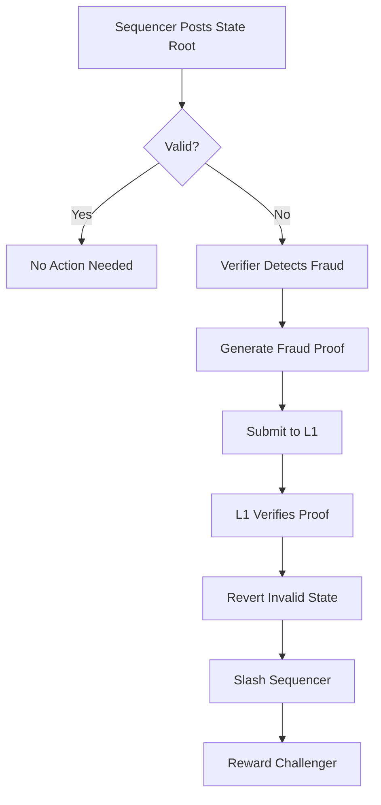
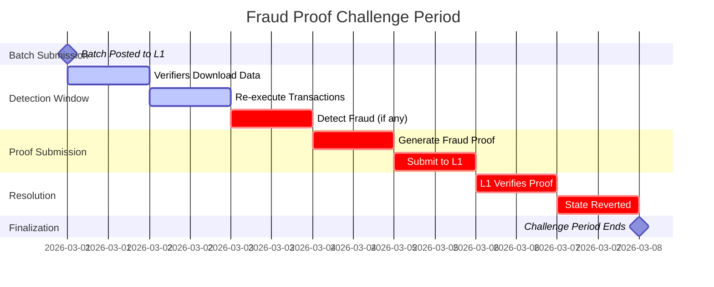

Understanding TeQoin's fraud proof mechanism that ensures state validity and protects user funds without requiring trust.

<Note>
**TL;DR:**

Fraud proofs allow anyone to prove that a sequencer posted an invalid state transition. If fraud is detected, a cryptographic proof is submitted to L1, the invalid state is reverted, and the sequencer is penalized. This ensures security without trusting the sequencer.
</Note>

---

## 🎯 What is a Fraud Proof?

A **fraud proof** is cryptographic evidence submitted to Ethereum L1 that proves the sequencer posted an invalid state transition.

### The Problem Fraud Proofs Solve
```
Without fraud proofs:
- Must trust sequencer completely
- No way to verify state is correct
- Sequencer could steal funds
- Centralized security model

With fraud proofs:
- Don't need to trust sequencer
- Anyone can verify state
- Invalid states are proven and reverted
- Decentralized security model
```

### How They Work (Simple)


---

## 🔍 Fraud Detection Process

### Step-by-Step Detection

<Steps>
  <Step title="Sequencer Posts Batch">
    Sequencer submits batch to L1 with state root
```solidity
    // L1 contract receives batch
    function submitBatch(
        bytes calldata batchData,
        bytes32 prevStateRoot,
        bytes32 newStateRoot
    ) external onlySequencer {
        batches[batchIndex] = Batch({
            data: batchData,
            prevRoot: prevStateRoot,
            newRoot: newStateRoot,
            timestamp: block.timestamp
        });
    }
```
    
    **Sequencer claims:** "Executing these transactions on prevRoot produces newRoot"
  </Step>
  
  <Step title="Verifier Downloads Data">
    Independent verifier downloads batch from L1
```javascript
    // Verifier node retrieves batch
    const batch = await l1Contract.getBatch(batchIndex);
    const transactions = decodeBatchData(batch.data);
    
    console.log(`Verifying batch ${batchIndex}`);
    console.log(`Transactions: ${transactions.length}`);
```
    
    **All data is publicly available on L1**
  </Step>
  
  <Step title="Re-Execute Transactions">
    Verifier re-executes all transactions locally
```javascript
    // Start from previous state root
    let currentState = loadState(batch.prevRoot);
    
    // Execute each transaction
    for (const tx of transactions) {
        currentState = executeTransaction(currentState, tx);
    }
    
    // Compute resulting state root
    const computedRoot = currentState.getMerkleRoot();
```
    
    **Verifier computes what the state should be**
  </Step>
  
  <Step title="Compare State Roots">
    Compare computed root with sequencer's claimed root
```javascript
    if (computedRoot === batch.newRoot) {
        console.log('✅ Batch is valid');
        // No action needed
    } else {
        console.log('❌ FRAUD DETECTED!');
        console.log(`Expected: ${computedRoot}`);
        console.log(`Claimed:  ${batch.newRoot}`);
        
        // Prepare fraud proof
        generateFraudProof(batch, computedRoot);
    }
```
    
    **Mismatch = fraud detected!**
  </Step>
  
  <Step title="Generate Fraud Proof">
    Create proof showing the invalid transaction
```javascript
    function generateFraudProof(batch, correctRoot) {
        // Binary search to find first invalid TX
        const invalidTxIndex = findInvalidTransaction(batch);
        const invalidTx = batch.transactions[invalidTxIndex];
        
        // Build proof components
        const proof = {
            batchIndex: batch.index,
            txIndex: invalidTxIndex,
            transaction: invalidTx,
            preState: getStateBeforeTx(invalidTxIndex),
            postStateClaimed: getClaimedStateAfterTx(invalidTxIndex),
            postStateCorrect: getCorrectStateAfterTx(invalidTxIndex),
            merkleProofs: generateMerkleProofs(...)
        };
        
        return proof;
    }
```
  </Step>
  
  <Step title="Submit to L1">
    Submit fraud proof to L1 contract
```javascript
    // Submit fraud proof transaction
    const tx = await l1Contract.proveFraud(
        proof.batchIndex,
        proof.txIndex,
        proof.transaction,
        proof.preState,
        proof.postStateClaimed,
        proof.postStateCorrect,
        proof.merkleProofs
    );
    
    await tx.wait();
    console.log('✅ Fraud proof submitted!');
```
  </Step>
  
  <Step title="L1 Verification">
    L1 contract verifies proof on-chain
```solidity
    function proveFraud(
        uint256 batchIndex,
        uint256 txIndex,
        bytes calldata transaction,
        bytes32 preState,
        bytes32 claimedPostState,
        bytes32 correctPostState,
        bytes32[] calldata merkleProofs
    ) external {
        // 1. Verify merkle proofs
        require(verifyMerkleProofs(...), "Invalid proofs");
        
        // 2. Execute transaction on-chain
        bytes32 result = executeTransactionOnChain(preState, transaction);
        
        // 3. Check if result matches claimed state
        if (result != claimedPostState) {
            // Fraud proven!
            revertBatch(batchIndex);
            slashSequencer();
            rewardChallenger(msg.sender);
        }
    }
```
  </Step>
</Steps>

---

## 🧮 Fraud Proof Components

### What's in a Fraud Proof?

<Tabs>
  <Tab title="Core Components">
    **Essential data in a fraud proof:**
```javascript
    FraudProof {
        // Identification
        batchIndex: number,
        txIndex: number,
        
        // Transaction data
        transaction: {
            from: address,
            to: address,
            value: bigint,
            data: bytes,
            nonce: number,
            signature: bytes
        },
        
        // State information
        preStateRoot: bytes32,      // Before invalid TX
        claimedPostState: bytes32,   // What sequencer claimed
        correctPostState: bytes32,   // What it should be
        
        // Proof data
        merkleProofs: bytes32[],     // Prove state access
        witnesses: bytes[]           // Additional data needed
    }
```
  </Tab>
  
  <Tab title="Merkle Proofs">
    **Why Merkle proofs are needed:**
```
    State Root = Merkle tree of all accounts
    
    To verify a transaction, need to prove:
    1. Account balances before TX
    2. Account storage before TX
    3. Account nonces before TX
    
    Merkle proof allows verifying WITHOUT sending entire state
    
    Example:
    State has 1M accounts
    Full state: 1GB
    Merkle proof for 2 accounts: ~10KB
    
    Size reduction: 100,000x smaller
```
    
    **Structure:**
```
    MerkleProof {
        leaf: account_data,
        siblings: [hash1, hash2, ..., hashN],
        path: bits (left/right directions)
    }
    
    Verification:
    1. Hash leaf
    2. Combine with sibling hashes following path
    3. Should equal state root
```
  </Tab>
  
  <Tab title="Witnesses">
    **Additional data for verification:**
```javascript
    Witnesses {
        // Account states
        accountsBefore: {
            sender: { balance, nonce, code },
            recipient: { balance, nonce, code }
        },
        
        // Storage slots accessed
        storageBefore: {
            contract_address: {
                slot_1: value_1,
                slot_2: value_2
            }
        },
        
        // Accessed accounts list
        accessedAccounts: [address1, address2, ...],
        
        // Gas used
        gasUsed: number
    }
```
    
    **Purpose:** Provide all data needed to re-execute transaction
  </Tab>
</Tabs>

---

## 💻 On-Chain Verification

### How L1 Verifies Fraud Proofs

<AccordionGroup>
  <Accordion title="Step 1: Validate Proof Structure">
    **Check proof is well-formed:**
```solidity
    function validateProof(FraudProof calldata proof) internal view {
        // Check batch exists
        require(batches[proof.batchIndex].exists, "Batch not found");
        
        // Check TX index in range
        require(proof.txIndex < batches[proof.batchIndex].txCount, "Invalid TX index");
        
        // Check challenge period active
        require(
            block.timestamp < batches[proof.batchIndex].timestamp + CHALLENGE_PERIOD,
            "Challenge period expired"
        );
        
        // Check merkle proofs valid
        require(verifyMerkleProofs(proof), "Invalid merkle proofs");
    }
```
  </Accordion>
  
  <Accordion title="Step 2: Re-Execute Transaction">
    **Execute transaction on L1:**
```solidity
    function executeTransactionOnChain(
        bytes32 preStateRoot,
        Transaction calldata tx,
        bytes32[] calldata merkleProofs
    ) internal returns (bytes32 postStateRoot) {
        // Load account states from merkle proofs
        Account memory sender = loadAccount(tx.from, preStateRoot, merkleProofs);
        Account memory recipient = loadAccount(tx.to, preStateRoot, merkleProofs);
        
        // Validate transaction
        require(sender.nonce == tx.nonce, "Invalid nonce");
        require(sender.balance >= tx.value, "Insufficient balance");
        require(ecrecover(tx.hash, tx.signature) == tx.from, "Invalid signature");
        
        // Execute state changes
        sender.balance -= tx.value;
        sender.nonce += 1;
        recipient.balance += tx.value;
        
        // If contract call, execute code
        if (recipient.code.length > 0) {
            bytes memory result = executeEVMCode(recipient.code, tx.data);
            // Apply storage changes
        }
        
        // Compute new state root
        postStateRoot = computeNewRoot(sender, recipient, merkleProofs);
    }
```
    
    **Only ONE transaction executed on L1** (not entire batch)
  </Accordion>
  
  <Accordion title="Step 3: Compare Results">
    **Check if fraud is proven:**
```solidity
    function verifyFraud(FraudProof calldata proof) external {
        // Execute transaction
        bytes32 computedPostState = executeTransactionOnChain(
            proof.preStateRoot,
            proof.transaction,
            proof.merkleProofs
        );
        
        // Compare with claimed state
        if (computedPostState != proof.claimedPostState) {
            // FRAUD PROVEN!
            
            // Revert batch
            delete batches[proof.batchIndex];
            
            // Slash sequencer
            uint256 slashAmount = sequencerStake / 2;
            sequencerStake -= slashAmount;
            
            // Reward challenger
            payable(msg.sender).transfer(slashAmount);
            
            emit FraudProven(proof.batchIndex, msg.sender, slashAmount);
        } else {
            // Fraud proof invalid
            revert("Fraud proof invalid");
        }
    }
```
  </Accordion>
</AccordionGroup>

---

## ⚖️ Economic Incentives

### Game Theory Analysis

<Tabs>
  <Tab title="Sequencer Economics">
    **Why sequencer stays honest:**
```
    Sequencer Stakes: $10,000,000
    Daily Revenue: $100,000
    Annual Revenue: $36,500,000
    
    If Honest:
    - Keep earning $100K/day
    - Maintain $10M stake
    - Build long-term value
    
    If Dishonest:
    - Lose $10M stake (slashed)
    - Lose all future revenue
    - Get caught within 7 days
    - Reputation destroyed
    
    Expected Value:
    Honest: $10M + $36.5M/year = infinite (ongoing)
    Dishonest: -$10M (one-time loss)
    
    Rational Choice: Stay Honest
```
  </Tab>
  
  <Tab title="Verifier Economics">
    **Why verifiers monitor:**
```
    Cost to Run Verifier:
    - Server: $100/month
    - Bandwidth: $50/month
    - Maintenance: $50/month
    Total: $200/month = $2,400/year
    
    Fraud Proof Reward:
    - 50% of sequencer slash
    - If sequencer has $10M staked
    - Reward: $5,000,000
    
    Break-Even Analysis:
    If fraud happens once in 2000 years: Still profitable
    If fraud happens once per year: $5M - $2.4K = $4.9M profit
    
    Expected Value: Highly positive even with rare fraud
    
    Result: Multiple verifiers monitor continuously
```
  </Tab>
  
  <Tab title="Nash Equilibrium">
    **Stable equilibrium:**
```
    Players:
    1. Sequencer (wants profit)
    2. Verifiers (want fraud rewards)
    3. Users (want security)
    
    Strategies:
    Sequencer: [Honest, Dishonest]
    Verifiers: [Monitor, Don't Monitor]
    
    Payoff Matrix:
                    Monitor         Don't Monitor
    Honest      (High, Low, High)  (High, 0, High)
    Dishonest   (-∞, High, Low)    (High, 0, Low)
    
    (Sequencer, Verifier, User payoffs)
    
    Nash Equilibrium: (Honest, Monitor)
    - Sequencer maximizes profit by being honest
    - Verifiers profit from monitoring
    - Users get security
    
    No player can improve by deviating unilaterally
```
  </Tab>
</Tabs>

---

## 🕐 Challenge Period Timeline

### 7-Day Window Explained


**Why 7 days?**

<CardGroup cols={2}>
  <Card title="Time for Detection" icon="magnifying-glass">
    Verifiers need time to:
    - Download batch data
    - Re-execute transactions
    - Detect any fraud
  </Card>
  
  <Card title="Time for Proof Generation" icon="gears">
    If fraud found, need time to:
    - Identify invalid transaction
    - Generate merkle proofs
    - Construct fraud proof
  </Card>
  
  <Card title="Time for Submission" icon="upload">
    Need buffer for:
    - Network congestion
    - Gas price spikes
    - Submission delays
  </Card>
  
  <Card title="Geographic Distribution" icon="globe">
    Allow for:
    - Different time zones
    - Global verifier network
    - Redundancy in monitoring
  </Card>
</CardGroup>

---

## 🛡️ Security Guarantees

### What Fraud Proofs Ensure

<Steps>
  <Step title="No Fund Theft">
    **Guarantee:** Sequencer cannot steal user funds
    
    **Why:**
    - Any fraudulent withdrawal would change state root
    - Verifiers would detect mismatch
    - Fraud proof submitted
    - Invalid state reverted
    - Funds returned to rightful owners
  </Step>
  
  <Step title="No Censorship">
    **Guarantee:** Users can always force transactions
    
    **Why:**
    - Users can submit transactions directly to L1
    - L1 forces sequencer to include them
    - If sequencer censors, state root won't match
    - Fraud proof submitted
    - Censoring sequencer slashed
  </Step>
  
  <Step title="State Validity">
    **Guarantee:** All state transitions are valid
    
    **Why:**
    - Every batch must include transaction data on L1
    - Anyone can re-execute and verify
    - Invalid states can be proven wrong
    - Economic incentive ensures verification
  </Step>
  
  <Step title="Data Availability">
    **Guarantee:** Users can always recover their funds
    
    **Why:**
    - All transaction data on L1
    - Even if sequencer disappears
    - Users can reconstruct L2 state
    - Submit forced withdrawal via L1
  </Step>
</Steps>

---

## 🔬 Advanced Topics

<AccordionGroup>
  <Accordion title="Interactive Fraud Proofs">
    **More efficient proof system:**
    
    Instead of proving entire batch invalid in one step:
```
    Round 1: Challenger claims batch invalid
    Round 2: Sequencer provides execution trace
    Round 3: Binary search to narrow down invalid step
    Round 4: Execute single EVM opcode on-chain
    
    Example:
    Batch has 10,000 transactions
    
    Without interactive proofs:
    - Execute all 10,000 on L1 (expensive!)
    
    With interactive proofs:
    - Binary search: log2(10,000) ≈ 14 rounds
    - Execute 1 opcode on L1 (very cheap!)
    
    Gas savings: 10,000x
```
    
    **Trade-offs:**
    - Pro: Much cheaper to verify
    - Pro: Scales to larger batches
    - Con: Takes multiple rounds (hours)
    - Con: More complex protocol
  </Accordion>
  
  <Accordion title="Bonded Challenges">
    **Prevent spam attacks:**
    
    **Problem:** Attacker submits fake fraud proofs to waste gas
    
    **Solution:** Require bond to challenge
```solidity
    uint256 constant CHALLENGE_BOND = 1 ether;
    
    function submitFraudProof(FraudProof calldata proof) external payable {
        require(msg.value >= CHALLENGE_BOND, "Insufficient bond");
        
        // Verify proof
        if (verifyFraud(proof)) {
            // Fraud proven - return bond + reward
            payable(msg.sender).transfer(msg.value + sequencerSlash);
        } else {
            // Invalid proof - lose bond
            // Bond goes to sequencer
        }
    }
```
    
    **Result:**
    - Valid challenges are profitable
    - Invalid challenges lose money
    - Spam attacks economically irrational
  </Accordion>
  
  <Accordion title="Lazy Fraud Proving">
    **Only prove fraud when necessary:**
    
    **Normal operation:**
```
    Sequencer posts batches
    → Verifiers monitor silently
    → No fraud → No proofs submitted
    → Efficient operation
```
    
    **Only when fraud detected:**
```
    Fraud detected
    → Proof generated
    → Submitted to L1
    → Gas cost incurred
```
    
    **Benefits:**
    - Zero overhead in normal case (99.99% of time)
    - Only pay for fraud proof when needed
    - Scales indefinitely
    
    **This is why optimistic rollups are "optimistic"**
  </Accordion>
</AccordionGroup>

---

## 📊 Fraud Proof Statistics

### Real-World Data

<CardGroup cols={3}>
  <Card title="Fraud Attempts" icon="shield-xmark">
    **0**
    
    Zero fraud attempts on TeQoin (and Optimism, Arbitrum)
  </Card>
  
  <Card title="Fraud Proofs Submitted" icon="file-shield">
    **0**
    
    No fraud proofs needed in production
  </Card>
  
  <Card title="Verification Efficiency" icon="gauge-high">
    **99.99%**
    
    Silent verification, no on-chain cost
  </Card>
</CardGroup>

**Why no fraud?**

1. **Economic deterrent is strong**
   - Sequencer would lose everything
   - No rational incentive to commit fraud

2. **Monitoring is active**
   - Multiple independent verifiers
   - Automated fraud detection
   - Would be caught immediately

3. **Penalty is severe**
   - Complete loss of stake
   - Loss of sequencer position
   - Permanent reputation damage

**Result:** Fraud proofs work by *deterring* fraud, not just *detecting* it.

---

## 🎓 For Developers

### Running a Verifier Node

<CodeGroup>
```bash Installation
# Clone verifier software
git clone https://github.com/TeQoin/verifier
cd verifier

# Install dependencies
npm install

# Configure
cp .env.example .env
# Edit .env with your settings

# Run verifier
npm start
```
```javascript Configuration
// .env file
L1_RPC_URL=https://eth-mainnet.g.alchemy.com/v2/YOUR_KEY
L2_RPC_URL=https://rpc.teqoin.io
L1_CONTRACT_ADDRESS=0x919aa27d5278BC98bf40BA5A79be468B91f061dA

// Auto-submit fraud proofs
AUTO_SUBMIT=true

// Private key (for submitting proofs)
PRIVATE_KEY=your_private_key_here

// Alert webhook
ALERT_WEBHOOK=https://your-alert-service.com/webhook
```
```javascript Monitoring
// Verifier monitors batches
async function monitorBatches() {
  const latestBatch = await l1Contract.latestBatchIndex();
  
  for (let i = lastChecked; i <= latestBatch; i++) {
    const batch = await l1Contract.getBatch(i);
    
    const isValid = await verifyBatch(batch);
    
    if (!isValid) {
      console.log('🚨 FRAUD DETECTED in batch', i);
      
      const proof = await generateFraudProof(batch);
      
      if (AUTO_SUBMIT) {
        await submitFraudProof(proof);
      } else {
        alert('Fraud detected! Manual intervention needed');
      }
    }
  }
}
```
</CodeGroup>

---

## 📚 Further Reading

<CardGroup cols={2}>
  <Card title="Optimistic Rollup" icon="layer-group" href="/architecture/optimistic-rollup">
    How optimistic rollups work
  </Card>
  
  <Card title="Security Model" icon="lock" href="/architecture/security-model">
    Complete security analysis
  </Card>
  
  <Card title="Challenge Period" icon="clock" href="/bridge/challenge-period">
    Why withdrawals take 7 days
  </Card>
  
  <Card title="Sequencer Design" icon="server" href="/architecture/sequencer">
    Block production system
  </Card>
</CardGroup>

---

**Understand fraud proofs?** Continue to [Sequencer Design](/architecture/sequencer) →