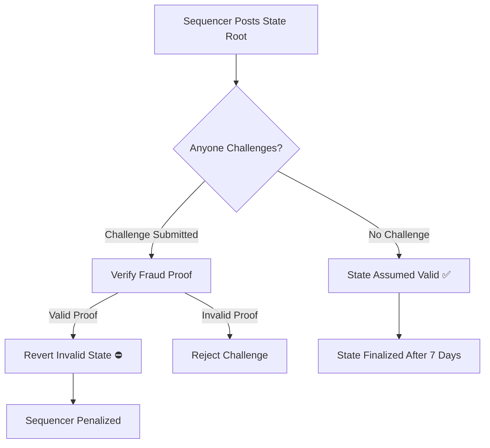
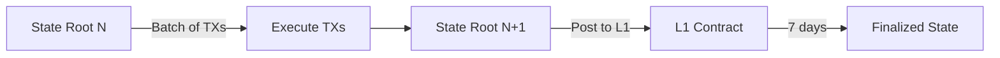

# Optimistic Rollup Technology

A deep dive into how TeQoin uses optimistic rollup technology to achieve high throughput, low fees, and Ethereum-grade security.

<Note>
**TL;DR:**

Optimistic rollups assume transactions are valid by default ("optimistic"), execute them off-chain for speed and cost savings, then post transaction data to Ethereum L1. A 7-day challenge period allows anyone to prove fraud if invalid transactions are submitted.
</Note>

---

## 🎯 What is an Optimistic Rollup?

An **optimistic rollup** is a Layer-2 scaling solution that:

1. **Executes transactions off-chain** (on L2) for speed and low cost
2. **Posts transaction data to L1** for security and data availability
3. **Assumes transactions are valid** by default (optimistic)
4. **Allows fraud proofs** to challenge invalid state transitions

### Key Insight
```
Instead of:  Every TX executed on expensive Ethereum L1
Optimistic:  Batch execute off-chain → Post proof to L1 → Challenge if wrong
Result:      100x cheaper, same security
```

---

## 🏗️ Core Concepts

### 1. Off-Chain Execution

<Tabs>
  <Tab title="The Problem">
    **Ethereum L1 is expensive because:**
    
    Every transaction must be:
    - Executed by all validators (~1 million nodes)
    - Verified by all nodes
    - Stored permanently on-chain
    
    **Cost:** Each transaction uses gas from 15-30 validators
    
    **Throughput:** Limited to ~15-30 TPS
  </Tab>
  
  <Tab title="The Solution">
    **Move execution off-chain:**
    
    On TeQoin L2:
    - Only sequencer executes transactions
    - Results posted to L1 (not re-executed)
    - L1 validators just store data
    
    **Cost:** Pay only for data storage, not execution
    
    **Throughput:** 1000+ TPS (limited by sequencer, not L1)
  </Tab>
  
  <Tab title="Example">
    **Transfer 1 ETH:**
    
    **On Ethereum L1:**
```
    1. User broadcasts TX
    2. 1M+ validators execute TX
    3. Each validator updates state
    4. TX included in L1 block
    
    Cost: $15 (high because of massive redundancy)
    Time: 12 seconds
```
    
    **On TeQoin L2:**
```
    1. User broadcasts TX
    2. Sequencer executes TX (only sequencer)
    3. State updated in L2 DB
    4. Data posted to L1 (not executed)
    
    Cost: $0.001 (only pay for L1 data posting)
    Time: 5 seconds
```
  </Tab>
</Tabs>

### 2. Data Availability on L1

<Steps>
  <Step title="All Data Goes to L1">
    Every L2 transaction's data is posted to Ethereum L1
    
    **What gets posted:**
    - Transaction inputs (to, value, data)
    - Signatures
    - Transaction ordering
    
    **Why this matters:**
    - Anyone can reconstruct L2 state from L1 data
    - Data cannot be hidden or censored
    - If sequencer disappears, users can recover
  </Step>
  
  <Step title="Compressed for Efficiency">
    Data is compressed before posting to L1
    
    **Compression techniques:**
    - Remove redundant data (chain ID, gas price)
    - Use signature aggregation
    - Batch multiple transactions together
    
    **Result:** ~12 bytes per transaction (vs 180 bytes if posted individually)
  </Step>
  
  <Step title="Posted as Calldata">
    Data posted to L1 contract calldata (not storage)
    
    **Why calldata:**
    - Much cheaper than storage (~16 gas/byte vs 20,000 gas/slot)
    - Still permanently available on L1
    - Can be retrieved by anyone
    
    **Cost savings:** ~10x cheaper than using storage
  </Step>
</Steps>

### 3. Optimistic Assumption

The core innovation of optimistic rollups:


**How it works:**

1. **Sequencer posts state root** to L1 (claims "this is the new state")
2. **Optimistic period begins** (7 days)
3. **Verifiers check** if state root is correct
4. **If correct:** No action, state becomes final after 7 days
5. **If incorrect:** Verifier submits fraud proof, invalid state reverted

---

## 🔄 Transaction Lifecycle in Detail

### Complete Flow

<Steps>
  <Step title="User Submits Transaction">
    User sends transaction to TeQoin RPC
```javascript
    // User's perspective
    const tx = await signer.sendTransaction({
      to: '0x...',
      value: ethers.parseEther('1.0')
    });
    // Returns immediately with TX hash
```
    
    **What happens:**
    - Transaction sent to sequencer's mempool
    - User receives transaction hash instantly
  </Step>
  
  <Step title="Sequencer Execution (5 seconds)">
    Sequencer includes TX in next L2 block
```
    Block N:
    - Collect transactions from mempool
    - Order transactions (FIFO or by priority)
    - Execute in EVM
    - Update state (balances, storage, etc.)
    - Generate receipts
    - Produce block every 5 seconds
```
    
    **User sees:** Transaction confirmed! (soft finality)
  </Step>
  
  <Step title="Batching (~10 minutes)">
    Sequencer batches many transactions together
```
    Batch Creation:
    - Collect 1000s of transactions
    - Compress transaction data
    - Compute new state root
    - Create batch package
```
    
    **Batch contains:**
    - Compressed transaction data
    - Previous state root
    - New state root
    - Batch metadata
  </Step>
  
  <Step title="Post to L1 (~10 minutes)">
    Batch posted to Ethereum L1
```solidity
    // L1 contract receives batch
    function submitBatch(
        bytes calldata batchData,
        bytes32 prevStateRoot,
        bytes32 newStateRoot
    ) external onlySequencer {
        // Store batch data in calldata
        // Record state root
        batches[batchIndex] = Batch({
            stateRoot: newStateRoot,
            timestamp: block.timestamp
        });
    }
```
    
    **L1 transaction contains:**
    - All L2 transaction data (compressed)
    - State root commitment
  </Step>
  
  <Step title="Challenge Period (7 days)">
    Anyone can verify and challenge
```
    Verifier Process:
    1. Download batch data from L1
    2. Re-execute transactions locally
    3. Compute state root
    4. Compare with sequencer's state root
    5. If mismatch → submit fraud proof
```
    
    **If fraud detected:**
    - Verifier submits proof to L1
    - L1 contract verifies proof
    - Invalid state reverted
    - Challenger rewarded, sequencer penalized
  </Step>
  
  <Step title="Finalization (After 7 days)">
    State becomes final
```
    After 7 days with no successful challenges:
    - State root is considered valid
    - Withdrawals can be finalized
    - State is permanently settled
```
  </Step>
</Steps>

---

## 🧮 State Management

### State Roots

**What is a state root?**

A cryptographic hash (Merkle root) representing the entire L2 state:
- All account balances
- All contract storage
- All account nonces
```
State Root = MerkleRoot(
    Account1: {balance, nonce, storage},
    Account2: {balance, nonce, storage},
    ...
    AccountN: {balance, nonce, storage}
)
```

### State Transition


**Example:**
```
Initial State (Root A):
- Alice: 10 ETH
- Bob: 5 ETH

Transaction: Alice sends 3 ETH to Bob

New State (Root B):
- Alice: 7 ETH
- Bob: 8 ETH

Sequencer posts: "Root A + [TX data] → Root B"

Verifiers check: Does executing TX on Root A produce Root B?
- If yes: Valid ✅
- If no: Fraud! Submit proof ⛔
```

---

## 🛡️ Security Through Fraud Proofs

### How Fraud Proofs Work

<Tabs>
  <Tab title="Normal Case (No Fraud)">
    **99.99% of the time:**
```
    Day 0:  Sequencer posts state root
           ✅ State root is correct
    
    Days 1-7: Verifiers check
           ✅ All verifications pass
           ✅ No fraud detected
    
    Day 7:  Challenge period ends
           ✅ State becomes final
           ✅ No fraud proofs needed
```
    
    **Result:** Efficient operation, no extra cost
  </Tab>
  
  <Tab title="Fraud Detected">
    **Rare case (fraud attempt):**
```
    Day 0:  Malicious sequencer posts INVALID state root
           ❌ State root is incorrect
    
    Day 2:  Verifier detects fraud
           🔍 Re-executes transactions
           ❌ State doesn't match
           📝 Prepares fraud proof
    
    Day 3:  Fraud proof submitted to L1
           📤 Proof sent to L1 contract
           ⚖️ L1 verifies proof on-chain
           ✅ Proof is valid
    
    Day 3:  Fraud prevented
           ⛔ Invalid state reverted
           🏆 Challenger rewarded
           💰 Sequencer slashed
           ✅ Correct state restored
```
    
    **Result:** System self-corrects, fraud prevented
  </Tab>
  
  <Tab title="Fraud Proof Construction">
    **What's in a fraud proof?**
```
    Fraud Proof Components:
    1. Invalid state transition claim
    2. Pre-state (before invalid TX)
    3. Transaction that was executed wrong
    4. Expected post-state (correct)
    5. Actual post-state (incorrect, from sequencer)
    6. Merkle proofs for all states
    
    L1 Contract Verification:
    - Re-executes SINGLE transaction on-chain
    - Compares result with sequencer's claim
    - If mismatch → fraud proven ✅
    - If match → fraud proof invalid ❌
```
    
    **Key insight:** Only need to execute ONE transaction on L1 to prove fraud
  </Tab>
</Tabs>

---

## 💰 Economic Security

### Incentive Structure

<AccordionGroup>
  <Accordion title="Why Sequencer Stays Honest">
    **Economic incentives keep sequencer honest:**
    
    **If honest:**
    - ✅ Earns fees from L2 transactions
    - ✅ Maintains reputation
    - ✅ Keeps sequencer position
    - ✅ Builds long-term value
    
    **If dishonest:**
    - ❌ Loses staked collateral (slashed)
    - ❌ Loses sequencer position
    - ❌ Loses all future fee revenue
    - ❌ Damages reputation permanently
    
    **Calculation:**
```
    Cost of being dishonest > Potential gain from fraud
    
    Example:
    Sequencer stake: $10M
    Daily revenue: $100K
    Annual revenue: $36M
    
    Attempting fraud risks: $10M stake + $36M/year future revenue
    Potential gain: One-time theft (detected within days)
    
    Rational choice: Stay honest
```
  </Accordion>
  
  <Accordion title="Why Verifiers Monitor">
    **Verifiers are incentivized to watch for fraud:**
    
    **Rewards:**
    - 🏆 Fraud proof reward (e.g., 1% of slashed stake)
    - 💰 Can be significant ($100K+)
    
    **Costs:**
    - 💻 Running a verifier node (~$100/month)
    - ⚡ Computing fraud proofs (minimal)
    
    **Break-even:**
```
    If fraud happens once per year:
    Reward: $100,000
    Annual cost: $1,200
    Net profit: $98,800
    
    Even 1 fraud per decade is profitable!
```
    
    **Result:** Multiple independent verifiers monitor continuously
  </Accordion>
  
  <Accordion title="Nash Equilibrium">
    **Game theory analysis:**
    
    **Players:**
    - Sequencer (wants to maximize profit)
    - Verifiers (want to catch fraud for rewards)
    - Users (want security)
    
    **Equilibrium:**
    - Sequencer stays honest (rational choice)
    - Verifiers monitor actively (profitable)
    - Users trust system (security guaranteed)
    
    **This is a stable equilibrium because:**
    - No player can improve by deviating
    - Fraud is always caught and punished
    - Honest behavior is most profitable
  </Accordion>
</AccordionGroup>

---

## 📊 Performance Analysis

### Scalability Breakdown

**How optimistic rollups achieve 100x+ scalability:**

| Factor | Improvement | How |
|--------|-------------|-----|
| **Off-chain Execution** | 100x | Only sequencer executes, not all L1 validators |
| **Batch Compression** | 15x | Compress transaction data before posting |
| **Calldata vs Storage** | 10x | Use cheap calldata instead of expensive storage |
| **No Proving Overhead** | N/A | No ZK proofs needed (unlike ZK rollups) |

**Combined effect:**
```
Cost reduction: 100x × 15x × 10x = 15,000x
Throughput: 15 TPS (L1) × 100 = 1,500+ TPS (L2)
```

### Gas Cost Comparison

**Example: Simple ETH transfer**
```
Ethereum L1:
- Execution: 21,000 gas
- Gas price: 50 gwei
- Cost: 0.00105 ETH (~$2-5)

TeQoin L2:
- Execution: ~free (done off-chain)
- L1 data posting: ~12 bytes
- Cost per TX (batched): 192 gas / batch_size
- With 1000 TXs in batch: 0.192 gas per TX
- At 50 gwei: 0.0000000096 ETH (~$0.001)

Improvement: ~5000x cheaper
```

---

## 🆚 Optimistic vs ZK Rollups

### Key Differences

| Aspect | Optimistic Rollups | ZK Rollups |
|--------|-------------------|------------|
| **Validity Assumption** | Assume valid (optimistic) | Prove valid (cryptographic) |
| **Proof Type** | Fraud proofs (if needed) | Validity proofs (always) |
| **Withdrawal Time** | 7 days | Hours |
| **Proof Generation** | Light (only for fraud) | Heavy (every batch) |
| **EVM Compatibility** | 100% (easy) | Harder (some limitations) |
| **Proving Cost** | Very low | High |
| **Technology Maturity** | Battle-tested | Newer, evolving |

### When to Choose Optimistic

**Optimistic rollups are better for:**

✅ Full EVM compatibility needed  
✅ Lower operational costs preferred  
✅ 7-day withdrawal acceptable  
✅ Proven, mature technology wanted  

**ZK rollups are better for:**

✅ Fast withdrawals critical  
✅ Higher proving costs acceptable  
✅ Some EVM limitations OK  
✅ Cutting-edge tech preferred  

**TeQoin chose optimistic because:**
- Full EVM compatibility = zero migration effort
- Lower costs = more sustainable long-term
- 7 days = acceptable for security trade-off
- Proven tech = less risk

---

## 🔬 Advanced Topics

<AccordionGroup>
  <Accordion title="Multi-Round Interactive Fraud Proofs">
    **More efficient fraud proof system:**
    
    Instead of re-executing entire batch on L1:
```
    Round 1: Challenger claims TX X is invalid
    Round 2: Sequencer provides execution trace
    Round 3: Binary search to find divergence point
    Round 4: Execute single opcode on-chain
    
    Result: Only 1 opcode verified on L1 (vs entire batch)
```
    
    **Benefits:**
    - Minimal L1 gas cost
    - Fast resolution
    - Scalable to large batches
    
    **Drawback:**
    - Takes multiple rounds (hours)
    - More complex implementation
  </Accordion>
  
  <Accordion title="Data Availability Sampling">
    **Future enhancement for even more scale:**
    
    Current: All data posted to L1 calldata
    
    Future: Data availability sampling (DAS)
    - Only sample of data posted to L1
    - Full data available on separate DA layer
    - Can be verified through random sampling
    
    **Potential improvements:**
    - 10-100x more data capacity
    - Even lower L1 costs
    - Higher throughput
    
    **Trade-off:**
    - Slightly weaker data availability guarantee
    - More complex verification
  </Accordion>
  
  <Accordion title="Parallel Transaction Execution">
    **Optimizing execution further:**
    
    Current: Sequential execution
    
    Future: Parallel execution
    - Identify independent transactions
    - Execute multiple TXs simultaneously
    - Merge results deterministically
    
    **Benefits:**
    - Higher throughput (2-10x)
    - Better hardware utilization
    - Lower latency
    
    **Challenges:**
    - Dependency detection
    - State conflict resolution
    - Maintaining determinism
  </Accordion>
</AccordionGroup>

---

## 📚 Further Reading

<CardGroup cols={2}>
  <Card title="Fraud Proofs" icon="shield-halved" href="/architecture/fraud-proofs">
    Deep dive into fraud proof system
  </Card>
  
  <Card title="Security Model" icon="lock" href="/architecture/security-model">
    Complete security analysis
  </Card>
  
  <Card title="Sequencer Design" icon="server" href="/architecture/sequencer">
    How block production works
  </Card>
  
  <Card title="Challenge Period" icon="clock" href="/bridge/challenge-period">
    Why withdrawals take 7 days
  </Card>
</CardGroup>

### External Resources

- **Optimism Specs:** https://github.com/ethereum-optimism/optimistic-specs
- **Arbitrum Docs:** https://developer.arbitrum.io/
- **Vitalik's Rollup Guide:** https://vitalik.ca/general/2021/01/05/rollup.html

---

**Understand optimistic rollups?** Continue to [Fraud Proofs](/architecture/fraud-proofs) →
