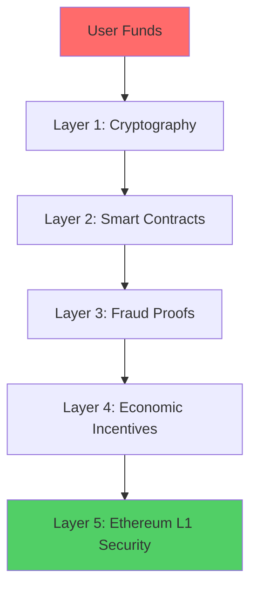

A complete analysis of TeQoin's security architecture, threat model, and security guarantees.

<Note>
**TL;DR:**

TeQoin inherits Ethereum's security through data availability on L1, fraud proofs for state validity, and economic incentives that make attacks unprofitable. Even with a malicious sequencer, user funds remain safe due to cryptographic proofs and decentralized verification.
</Note>

---

## 🎯 Security Guarantees

### What TeQoin Guarantees

<CardGroup cols={2}>
  <Card title="Fund Safety" icon="vault">
    **Your funds cannot be stolen**
    
    Even with malicious sequencer
  </Card>
  
  <Card title="State Validity" icon="check-circle">
    **All state transitions are valid**
    
    Invalid states are proven and reverted
  </Card>
  
  <Card title="Data Availability" icon="database">
    **All transaction data on L1**
    
    Users can always reconstruct state
  </Card>
  
  <Card title="Censorship Resistance" icon="shield">
    **Transactions cannot be censored**
    
    Force inclusion via L1
  </Card>
  
  <Card title="Liveness" icon="heartbeat">
    **System always operational**
    
    Can recover even if sequencer fails
  </Card>
  
  <Card title="No Custody" icon="key">
    **Self-custodial**
    
    Only you control your private keys
  </Card>
</CardGroup>

---

## 🏗️ Security Layers

### Defense in Depth


<Steps>
  <Step title="Layer 1: Cryptographic Security">
    **Foundation: Math and cryptography**
```
    Private Key → Public Key → Address
    
    - ECDSA signatures (secp256k1)
    - Keccak-256 hashing
    - Merkle trees for state commitments
```
    
    **Guarantees:**
    - Only private key owner can sign transactions
    - Signatures cannot be forged
    - State roots cannot be faked
    
    **Attack resistance:**
    - Requires breaking ECDSA (computationally infeasible)
    - Would need to break SHA-256 class hashes
  </Step>
  
  <Step title="Layer 2: Smart Contract Security">
    **L1 contracts enforce rules**
```solidity
    // L1 Bridge Contract
    - Holds all L2 ETH backing (locked)
    - Only releases with valid proof
    - Challenge period enforced
    - Immutable after deployment
```
    
    **Guarantees:**
    - Code is law (deterministic execution)
    - No admin keys can bypass rules
    - Audited by multiple firms
    - Battle-tested on Ethereum
    
    **Attack resistance:**
    - Would need to exploit smart contract bugs
    - Multiple audits reduce risk
    - Time-tested patterns used
  </Step>
  
  <Step title="Layer 3: Fraud Proof Security">
    **Invalid states are provably detected**
```
    Invalid State Submitted
    ↓
    Verifiers Detect Fraud
    ↓
    Fraud Proof Submitted
    ↓
    L1 Verifies Proof
    ↓
    Invalid State Reverted
```
    
    **Guarantees:**
    - Any invalid state can be proven wrong
    - Proof verified on-chain (trustless)
    - Malicious sequencer slashed
    - Correct state restored
    
    **Attack resistance:**
    - Would need all verifiers to collude
    - Economic incentive ensures verification
  </Step>
  
  <Step title="Layer 4: Economic Security">
    **Rational actors stay honest**
```
    Sequencer Stake: $10M
    Daily Revenue: $100K
    Annual Revenue: $36M
    
    Attack Gain: < $1M (gets caught)
    Attack Cost: $10M stake + $36M future revenue
    
    Result: Attack is irrational
```
    
    **Guarantees:**
    - Honest behavior is most profitable
    - Fraud is always caught (7-day period)
    - Penalties exceed any possible gain
    
    **Attack resistance:**
    - Would require irrational economic behavior
    - Would need to sacrifice massive value
  </Step>
  
  <Step title="Layer 5: Ethereum L1 Security">
    **Inherit Ethereum's security**
```
    L1 Security:
    - $40B+ staked ETH
    - 1M+ validators worldwide
    - 15+ years of security research
    - Battle-tested consensus
```
    
    **Guarantees:**
    - L1 contracts cannot be manipulated
    - L1 data cannot be censored
    - L1 state is final
    
    **Attack resistance:**
    - Would need to attack Ethereum itself
    - Requires 51% of validators (~$20B)
  </Step>
</Steps>

---

## 🎭 Threat Model

### Attack Scenarios & Defenses

<AccordionGroup>
  <Accordion title="1. Malicious Sequencer Attempts Theft">
    **Attack:** Sequencer tries to steal user funds
    
    **Method:**
```
    Sequencer posts invalid state:
    - Claims Alice has 0 ETH (was 10 ETH)
    - Claims Sequencer has 10 ETH more
    
    State Root: MerkleRoot(malicious_state)
```
    
    **Defense:**
```
    1. Verifier downloads batch from L1
    2. Re-executes all transactions
    3. Computes correct state root
    4. State roots don't match!
    5. Verifier submits fraud proof
    6. L1 contract verifies proof
    7. Invalid state reverted
    8. Sequencer slashed ($10M loss)
    9. Alice keeps her 10 ETH
```
    
    **Result:** ✅ Attack fails, attacker loses stake
  </Accordion>
  
  <Accordion title="2. Sequencer Censors User Transactions">
    **Attack:** Sequencer refuses to include user's transactions
    
    **Method:**
```
    User submits withdrawal TX
    Sequencer ignores it indefinitely
    User cannot withdraw funds
```
    
    **Defense:**
```
    User's options:
    
    Option 1: Force Inclusion via L1
    - Submit TX directly to L1 contract
    - L1 contract forces sequencer to include
    - If sequencer refuses → slashed
    
    Option 2: Exit via L1
    - Submit Merkle proof of L2 balance to L1
    - L1 contract validates proof
    - Withdraw directly from L1 bridge
```
    
    **Result:** ✅ Censorship impossible long-term
  </Accordion>
  
  <Accordion title="3. Sequencer Goes Offline">
    **Attack:** Sequencer stops producing blocks (DoS)
    
    **Method:**
```
    Sequencer server crashes
    No new blocks produced
    Users cannot transact
```
    
    **Defense:**
```
    Short-term (hours):
    - Sequencer backup nodes activate
    - Automatic failover
    - Service continues
    
    Long-term (days):
    - Users submit forced transactions via L1
    - Users can exit directly to L1
    - New sequencer can be appointed
    
    State Recovery:
    - All data on L1 (data availability)
    - Anyone can reconstruct L2 state
    - New sequencer resumes from last state
```
    
    **Result:** ✅ System remains operational
  </Accordion>
  
  <Accordion title="4. Verifiers Collude with Sequencer">
    **Attack:** All verifiers agree to ignore fraud
    
    **Method:**
```
    Sequencer bribes all verifiers
    Sequencer posts invalid state
    No verifiers submit fraud proof
    Invalid state becomes final after 7 days
```
    
    **Defense:**
```
    Economic Reality:
    - Verifiers are permissionless (anyone can run)
    - Only need 1 honest verifier
    - Bribe cost: Must pay ALL potential verifiers
    - Includes: Every Ethereum user globally
    
    Cost to bribe everyone: Infinite
    Cost to run verifier: $200/month
    Fraud proof reward: $5M
    
    Result: Economically impossible to bribe everyone
    
    Even if 99.99% bribed:
    - 0.01% honest = attack fails
    - 1 honest verifier = attack fails
```
    
    **Result:** ✅ Attack requires bribing everyone (impossible)
  </Accordion>
  
  <Accordion title="5. L1 Contract Exploit">
    **Attack:** Find bug in L1 smart contracts
    
    **Method:**
```
    Attacker finds vulnerability
    Exploits to drain bridge funds
    Steals locked ETH
```
    
    **Defense:**
```
    Prevention:
    - Multiple security audits
    - Formal verification
    - Bug bounty program ($1M+ rewards)
    - Gradual rollout (start small)
    - Circuit breakers
    
    If exploit found:
    - Pause mechanism activated
    - Governance can upgrade
    - Insurance fund covers losses
    - Community recovery process
```
    
    **Result:** ⚠️ Low risk but possible (mitigated heavily)
  </Accordion>
  
  <Accordion title="6. 51% Attack on Ethereum L1">
    **Attack:** Attacker controls Ethereum consensus
    
    **Method:**
```
    Attacker acquires 51% of Ethereum validators
    Reverts L1 transactions
    Manipulates L1 data
```
    
    **Defense:**
```
    Reality:
    - Would need ~$20B to acquire 51%
    - Would destroy ETH value (self-defeating)
    - Ethereum social consensus would fork
    - Attack detection and response
    
    If this happens:
    - TeQoin is compromised
    - So is all of Ethereum
    - So is all of DeFi
    - Economic apocalypse
```
    
    **Result:** ⚠️ Inherits Ethereum's security assumptions
  </Accordion>
</AccordionGroup>

---

## 💰 Economic Security Analysis

### Cost-Benefit for Attackers

<Tabs>
  <Tab title="Attack Costs">
    **What would attacks cost?**
    
    | Attack Type | Cost | Success Probability |
    |-------------|------|---------------------|
    | **Steal funds (sequencer)** | $10M stake + $36M/year revenue | 0% (fraud proof) |
    | **Censor transactions** | $10M stake + reputation | 0% (force inclusion) |
    | **Bribe all verifiers** | Infinite (permissionless) | 0% (need everyone) |
    | **51% Ethereum** | $20B+ | ~0% (social consensus) |
    | **Smart contract exploit** | Research time + $1M bounty | 1% (audited) |
    
    **Takeaway:** All attacks are either impossible or economically irrational
  </Tab>
  
  <Tab title="Defender Incentives">
    **Why people defend the system:**
    
    **Sequencer:**
```
    Honest Revenue: $36M/year
    Dishonest Gain: -$10M (slashed)
    
    Incentive: Stay honest
```
    
    **Verifiers:**
```
    Cost: $2,400/year
    Fraud Proof Reward: $5M (one-time)
    Expected Value: Highly positive
    
    Incentive: Monitor actively
```
    
    **Users:**
```
    Benefit: Secure funds
    Cost: None (just use it)
    
    Incentive: Use TeQoin
```
    
    **Ethereum Validators:**
```
    Benefit: L2 usage increases ETH value
    Cost: None (L2 pays for L1 security)
    
    Incentive: Support L2s
```
  </Tab>
  
  <Tab title="Nash Equilibrium">
    **Game theory stable state:**
```
    Players: Sequencer, Verifiers, Users
    
    Strategies:
    - Sequencer: [Honest, Dishonest]
    - Verifiers: [Monitor, Ignore]
    - Users: [Use, Don't Use]
    
    Payoff Matrix (simplified):
    
                        Verifiers Monitor
    Sequencer Honest:   (High, Medium, High)
    Sequencer Dishonest:(-∞, High, Medium)
    
                        Verifiers Ignore
    Sequencer Honest:   (High, Low, High)
    Sequencer Dishonest:(High, Low, -∞)
    
    Nash Equilibrium: (Honest, Monitor, Use)
    
    - Sequencer: Stay honest (maximizes profit)
    - Verifiers: Monitor (profitable)
    - Users: Use system (secure)
    
    No player benefits from deviating!
```
  </Tab>
</Tabs>

---

## 🔐 Security Assumptions

### What We Trust

<Tabs>
  <Tab title="Cryptographic Assumptions">
    **We assume these are secure:**
    
    ✅ **ECDSA (secp256k1)**
    - Used for signatures
    - Same as Bitcoin/Ethereum
    - No known attacks
    
    ✅ **Keccak-256 (SHA-3)**
    - Used for hashing
    - Cryptographically secure
    - Collision resistant
    
    ✅ **Merkle Trees**
    - State commitments
    - Mathematically proven
    - Tamper-evident
    
    **Risk:** Cryptography is broken
    **Likelihood:** Extremely low (decades of research)
    **Impact:** All of crypto breaks (not just TeQoin)
  </Tab>
  
  <Tab title="Ethereum L1 Security">
    **We assume Ethereum is secure:**
    
    ✅ **Consensus**
    - Proof of Stake works
    - 1M+ validators
    - $40B+ staked
    
    ✅ **EVM**
    - Smart contracts execute correctly
    - No consensus bugs
    - Deterministic execution
    
    ✅ **Data Availability**
    - L1 data is always available
    - Cannot be censored
    - Validators honest majority
    
    **Risk:** Ethereum is compromised
    **Likelihood:** Very low (most secure blockchain)
    **Impact:** All Ethereum L2s affected
  </Tab>
  
  <Tab title="Economic Assumptions">
    **We assume rational economic behavior:**
    
    ✅ **Rational Actors**
    - People maximize profit
    - Don't destroy value irrationally
    - Follow economic incentives
    
    ✅ **Market Efficiency**
    - Fraud proof rewards attract verifiers
    - Competition ensures verification
    - Prices reflect information
    
    ✅ **No Infinite Resources**
    - Attackers have budget limits
    - Can't bribe everyone
    - Can't sustain losses indefinitely
    
    **Risk:** Irrational actors with unlimited funds
    **Likelihood:** Very low (markets are rational)
    **Impact:** Could enable certain attacks
  </Tab>
  
  <Tab title="What We DON'T Trust">
    **System is secure WITHOUT trusting:**
    
    ❌ **Sequencer**
    - Assume potentially malicious
    - Fraud proofs ensure validity
    - Economic penalties deter attacks
    
    ❌ **Any Single Verifier**
    - Permissionless verification
    - Only need 1 honest verifier
    - Economic incentive ensures many
    
    ❌ **TeQoin Team**
    - Cannot access user funds
    - Cannot bypass L1 contracts
    - Cannot censor indefinitely
    
    **This is trustless security!**
  </Tab>
</Tabs>

---

## 🛡️ Security Best Practices

### For Users

<CardGroup cols={2}>
  <Card title="Secure Your Private Key" icon="key">
    **Critical:**
    - Use hardware wallet (Ledger, Trezor)
    - Never share private key
    - Backup seed phrase securely
    - Use strong passwords
  </Card>
  
  <Card title="Verify Transactions" icon="magnifying-glass">
    **Before signing:**
    - Check recipient address
    - Verify amount
    - Review contract interactions
    - Check network (L1 vs L2)
  </Card>
  
  <Card title="Use Official Interfaces" icon="shield-check">
    **Only trust:**
    - https://bridge.teqoin.io
    - https://rpc.teqoin.io
    - Official documentation
    - Verified contract addresses
  </Card>
  
  <Card title="Start Small" icon="coins">
    **Test first:**
    - Send small amount initially
    - Verify it arrives
    - Then send larger amounts
    - Don't risk everything at once
  </Card>
</CardGroup>

### For Developers

<CardGroup cols={2}>
  <Card title="Audit Your Contracts" icon="magnifying-glass-chart">
    **Before mainnet:**
    - Multiple security audits
    - Formal verification if possible
    - Bug bounty program
    - Test on testnet extensively
  </Card>
  
  <Card title="Handle Reorgs" icon="arrows-rotate">
    **L2 blocks can reorg:**
    - Wait for L1 finality (7 days)
    - For soft finality, wait 5-10 blocks
    - Don't assume instant finality
    - Handle reorg scenarios
  </Card>
  
  <Card title="Validate Inputs" icon="check">
    **Never trust user input:**
    - Validate all addresses
    - Check amount bounds
    - Verify signatures
    - Sanitize data
  </Card>
  
  <Card title="Plan for Emergencies" icon="triangle-exclamation">
    **Emergency procedures:**
    - Pause mechanisms
    - Upgrade paths
    - Recovery procedures
    - Communication plans
  </Card>
</CardGroup>

---

## 📊 Security Comparison

### TeQoin vs Other L2s

| Security Aspect | TeQoin | Optimism | Arbitrum | zkSync | Polygon |
|----------------|--------|----------|----------|---------|---------|
| **Data Availability** | L1 | L1 | L1 | L1 | Sidechain |
| **Validity Proofs** | Fraud Proofs | Fraud Proofs | Fraud Proofs | ZK Proofs | None |
| **Withdrawal Time** | 7 days | 7 days | 7 days | Hours | Instant |
| **Sequencer** | Centralized* | Centralized* | Centralized* | Centralized* | Validators |
| **EVM Compatibility** | 100% | 100% | 99%+ | ~95% | 100% |
| **Security Level** | Ethereum | Ethereum | Ethereum | Ethereum | Lower |

*Decentralization roadmap planned

**Key Takeaway:** TeQoin has Ethereum-grade security through L1 data availability and fraud proofs

---

## 🔬 Formal Security Properties

### Mathematical Guarantees

<AccordionGroup>
  <Accordion title="Safety">
    **Nothing bad ever happens**
    
    **Formal property:**
```
    ∀ state S: 
      validStateTransition(S_prev, TX, S_new) ∨ 
      ∃ fraudProof: proves_invalid(S_new)
```
    
    **In English:**
    For any state transition, either:
    1. It's valid according to EVM rules, OR
    2. There exists a fraud proof proving it's invalid
    
    **Result:** Invalid states cannot persist
  </Accordion>
  
  <Accordion title="Liveness">
    **Something good eventually happens**
    
    **Formal property:**
```
    ∀ transaction TX: 
      eventually(TX_included_in_block) ∨ 
      user_can_force_include(TX)
```
    
    **In English:**
    For any transaction, either:
    1. It will eventually be included by sequencer, OR
    2. User can force inclusion via L1
    
    **Result:** Transactions cannot be censored forever
  </Accordion>
  
  <Accordion title="Data Availability">
    **All data is always available**
    
    **Formal property:**
```
    ∀ L2_block B: 
      ∃ L1_calldata D: contains(D, all_transactions(B))
```
    
    **In English:**
    For every L2 block:
    - Transaction data exists on L1
    - Available to all participants
    - Cannot be hidden or deleted
    
    **Result:** State can always be reconstructed
  </Accordion>
</AccordionGroup>

---

## 🎯 Security Guarantees Summary

### What You Can Trust

<Steps>
  <Step title="Your Funds Are Safe">
    ✅ Cannot be stolen by sequencer  
    ✅ Cannot be frozen indefinitely  
    ✅ Can always be withdrawn (7 days)  
    ✅ Protected by Ethereum L1 security  
  </Step>
  
  <Step title="State is Valid">
    ✅ All state transitions follow EVM rules  
    ✅ Invalid states are proven and reverted  
    ✅ Economic incentive ensures verification  
    ✅ Fraud proofs work automatically  
  </Step>
  
  <Step title="Censorship Resistant">
    ✅ Transactions cannot be censored permanently  
    ✅ Can force inclusion via L1  
    ✅ Can exit system anytime  
    ✅ Sequencer slashed for censorship  
  </Step>
  
  <Step title="Trustless">
    ✅ Don't need to trust sequencer  
    ✅ Don't need to trust verifiers  
    ✅ Don't need to trust TeQoin team  
    ✅ Only trust math and economics  
  </Step>
</Steps>

---

## 📚 Additional Resources

<CardGroup cols={2}>
  <Card title="Fraud Proofs" icon="shield-halved" href="/architecture/fraud-proofs">
    How fraud detection works
  </Card>
  
  <Card title="Optimistic Rollup" icon="layer-group" href="/architecture/optimistic-rollup">
    Core technology explained
  </Card>
  
  <Card title="Sequencer Design" icon="server" href="/architecture/sequencer">
    Block production system
  </Card>
  
  <Card title="Challenge Period" icon="clock" href="/bridge/challenge-period">
    Why withdrawals take 7 days
  </Card>
</CardGroup>

---

## 🎉 Architecture Section Complete!

You've completed all architecture documentation:

- ✅ Technical Overview
- ✅ Optimistic Rollup
- ✅ Fraud Proofs
- ✅ Sequencer Design
- ✅ Security Model

**Ready to build securely on TeQoin L2!** 🚀