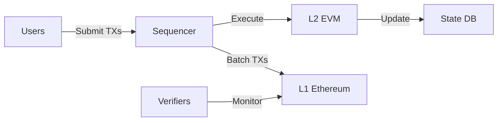

A deep dive into TeQoin's sequencer - the component responsible for ordering transactions, producing blocks, and posting batches to Ethereum L1.

<Note>
**TL;DR:**

The sequencer is the heart of TeQoin L2. It receives transactions, orders them, executes them in the EVM, produces blocks every 5 seconds, and posts batches to Ethereum L1. While currently centralized for simplicity, the system is designed to be fraud-proof secure regardless of sequencer behavior.
</Note>

---

## 🎯 What is the Sequencer?

The **sequencer** is the component that:
- Receives transactions from users
- Orders transactions deterministically
- Executes transactions in the EVM
- Produces L2 blocks
- Posts transaction batches to L1

### Role in the System


**Think of the sequencer as:**
- The "block producer" for L2 (like miners/validators on L1)
- The "coordinator" that orders transactions
- The "publisher" that posts data to L1

---

## 🏗️ Sequencer Architecture

### High-Level Components

<Tabs>
  <Tab title="RPC Interface">
    **User-facing transaction submission**
```
    RPC Server (JSON-RPC 2.0)
    ↓
    Accepts:
    - eth_sendRawTransaction
    - eth_call
    - eth_estimateGas
    - eth_getTransactionReceipt
    - etc.
    
    Returns:
    - Transaction hashes
    - Receipts
    - State queries
```
    
    **Endpoints:**
    - Primary: https://rpc.teqoin.io
    - Backup: https://rpc-backup.teqoin.io
    - WebSocket: wss://ws.teqoin.io
  </Tab>
  
  <Tab title="Transaction Pool">
    **Mempool management**
```javascript
    TransactionPool {
        pending: Map<address, Transaction[]>,
        queued: Map<address, Transaction[]>,
        
        add(tx: Transaction) {
            // Validate transaction
            if (!this.validate(tx)) {
                throw new Error('Invalid transaction');
            }
            
            // Check nonce ordering
            if (tx.nonce === expectedNonce) {
                this.pending.add(tx);
            } else {
                this.queued.add(tx);
            }
        },
        
        getNextTransactions(limit: number) {
            // Return transactions ready for inclusion
            return this.pending.slice(0, limit);
        }
    }
```
    
    **Features:**
    - Nonce ordering
    - Gas price prioritization
    - Duplicate detection
    - Transaction eviction
  </Tab>
  
  <Tab title="Block Producer">
    **L2 block creation**
```javascript
    class BlockProducer {
        async produceBlock() {
            // Get pending transactions
            const txs = this.pool.getNextTransactions(10000);
            
            // Execute transactions
            const results = await this.executor.executeBatch(txs);
            
            // Create block
            const block = {
                number: this.currentBlockNumber++,
                timestamp: Date.now(),
                transactions: txs,
                receipts: results.receipts,
                stateRoot: results.stateRoot,
                gasUsed: results.totalGas
            };
            
            // Store block
            await this.db.saveBlock(block);
            
            // Emit to subscribers
            this.emit('newBlock', block);
            
            return block;
        }
    }
```
    
    **Timing:** New block every 5 seconds
  </Tab>
  
  <Tab title="Batch Publisher">
    **L1 data posting**
```javascript
    class BatchPublisher {
        async publishBatch() {
            // Collect blocks since last batch
            const blocks = await this.getUnpublishedBlocks();
            
            // Compress transaction data
            const batchData = this.compress(blocks);
            
            // Compute state root
            const stateRoot = blocks[blocks.length - 1].stateRoot;
            
            // Post to L1
            const tx = await this.l1Contract.submitBatch(
                batchData,
                this.prevStateRoot,
                stateRoot
            );
            
            await tx.wait();
            
            console.log(`Batch published: ${blocks.length} blocks`);
        }
    }
```
    
    **Frequency:** Every ~10 minutes (or when batch is full)
  </Tab>
</Tabs>

---

## 🔄 Transaction Flow Through Sequencer

### Complete Lifecycle

<Steps>
  <Step title="Transaction Submission">
    User submits transaction via RPC
```javascript
    // User's wallet
    const tx = await signer.sendTransaction({
      to: '0x...',
      value: ethers.parseEther('1.0')
    });
    
    console.log('TX submitted:', tx.hash);
    // Returns immediately with TX hash
```
    
    **Sequencer receives:**
```json
    {
      "from": "0x...",
      "to": "0x...",
      "value": "1000000000000000000",
      "nonce": 42,
      "gasLimit": "21000",
      "gasPrice": "1000000000",
      "data": "0x",
      "signature": "0x..."
    }
```
  </Step>
  
  <Step title="Validation">
    Sequencer validates transaction
```javascript
    function validateTransaction(tx) {
        // 1. Check signature
        const signer = recoverSigner(tx);
        if (signer !== tx.from) {
            throw new Error('Invalid signature');
        }
        
        // 2. Check nonce
        const expectedNonce = await getAccountNonce(tx.from);
        if (tx.nonce < expectedNonce) {
            throw new Error('Nonce too low');
        }
        
        // 3. Check balance
        const balance = await getAccountBalance(tx.from);
        const totalCost = tx.value + (tx.gasLimit * tx.gasPrice);
        if (balance < totalCost) {
            throw new Error('Insufficient funds');
        }
        
        // 4. Check gas limit
        if (tx.gasLimit < 21000) {
            throw new Error('Gas limit too low');
        }
        
        return true;
    }
```
  </Step>
  
  <Step title="Mempool Addition">
    Add to transaction pool
```javascript
    // Add to appropriate queue
    if (tx.nonce === expectedNonce) {
        mempool.pending.push(tx);
        console.log('Added to pending:', tx.hash);
    } else {
        mempool.queued.push(tx);
        console.log('Added to queue:', tx.hash);
    }
    
    // Sort by gas price (if needed)
    mempool.pending.sort((a, b) => b.gasPrice - a.gasPrice);
```
  </Step>
  
  <Step title="Block Production (5 seconds)">
    Include in next block
```javascript
    // Every 5 seconds
    setInterval(async () => {
        // Select transactions
        const txsToInclude = selectTransactions(mempool);
        
        // Execute in EVM
        const results = await executeTransactions(txsToInclude);
        
        // Create block
        const block = createBlock(txsToInclude, results);
        
        // Save and broadcast
        await saveBlock(block);
        broadcastBlock(block);
        
        console.log(`Block ${block.number} produced`);
    }, 5000);
```
    
    **User sees confirmation in ~5 seconds**
  </Step>
  
  <Step title="Batching (~10 minutes)">
    Collect blocks into batch
```javascript
    // Every 10 minutes (or when batch full)
    setInterval(async () => {
        const blocks = getUnpublishedBlocks();
        
        if (blocks.length === 0) return;
        
        const batch = {
            blockStart: blocks[0].number,
            blockEnd: blocks[blocks.length - 1].number,
            transactions: compressTransactions(blocks),
            prevStateRoot: blocks[0].parentStateRoot,
            newStateRoot: blocks[blocks.length - 1].stateRoot
        };
        
        await publishBatch(batch);
    }, 600000); // 10 minutes
```
  </Step>
  
  <Step title="L1 Publication">
    Post batch to Ethereum
```javascript
    async function publishBatch(batch) {
        // Encode batch data
        const batchData = encodeBatch(batch);
        
        // Submit to L1
        const tx = await l1Contract.submitBatch(
            batchData,
            batch.prevStateRoot,
            batch.newStateRoot,
            {
                gasLimit: 500000,
                gasPrice: await getOptimalGasPrice()
            }
        );
        
        console.log('Batch submitted to L1:', tx.hash);
        await tx.wait();
        console.log('Batch confirmed on L1');
    }
```
  </Step>
</Steps>

---

## 📊 Transaction Ordering

### How Sequencer Orders Transactions

<Tabs>
  <Tab title="FIFO (Current)">
    **First-In-First-Out ordering**
```javascript
    // Simple FIFO
    function selectTransactions(mempool) {
        // Return transactions in order received
        return mempool.pending.slice(0, BLOCK_SIZE_LIMIT);
    }
```
    
    **Characteristics:**
    - ✅ Simple and predictable
    - ✅ No MEV (Maximal Extractable Value)
    - ✅ Fair to all users
    - ❌ No priority for urgent transactions
    
    **Current implementation on TeQoin**
  </Tab>
  
  <Tab title="Gas Price Priority">
    **Order by gas price (like Ethereum)**
```javascript
    function selectTransactions(mempool) {
        // Sort by gas price (highest first)
        const sorted = mempool.pending.sort(
            (a, b) => b.gasPrice - a.gasPrice
        );
        
        // Fill block with highest paying TXs
        let gasUsed = 0;
        const selected = [];
        
        for (const tx of sorted) {
            if (gasUsed + tx.gasLimit > BLOCK_GAS_LIMIT) break;
            selected.push(tx);
            gasUsed += tx.gasLimit;
        }
        
        return selected;
    }
```
    
    **Characteristics:**
    - ✅ Market-based priority
    - ✅ Revenue maximization
    - ❌ Enables MEV
    - ❌ Can be expensive for users
    
    **Possible future option**
  </Tab>
  
  <Tab title="Fair Ordering">
    **Time-based fairness**
```javascript
    function selectTransactions(mempool) {
        // Order by timestamp (encrypted until inclusion)
        const sorted = mempool.pending.sort(
            (a, b) => a.timestamp - b.timestamp
        );
        
        return sorted.slice(0, BLOCK_SIZE_LIMIT);
    }
```
    
    **Characteristics:**
    - ✅ Fair to all users
    - ✅ Prevents front-running
    - ✅ No MEV
    - ❌ More complex to implement
    
    **Research direction**
  </Tab>
</Tabs>

---

## ⚙️ Block Production Details

### Block Structure
```javascript
Block {
    // Header
    number: number,              // Block number
    timestamp: number,           // Block timestamp
    parentHash: bytes32,         // Previous block hash
    stateRoot: bytes32,          // State root after execution
    transactionsRoot: bytes32,   // Merkle root of transactions
    receiptsRoot: bytes32,       // Merkle root of receipts
    
    // Body
    transactions: Transaction[], // All transactions in block
    
    // Metadata
    gasUsed: bigint,            // Total gas used
    gasLimit: bigint,           // Block gas limit
    sequencer: address,         // Sequencer address
    l1BlockNumber: number       // L1 block reference
}
```

### Block Production Algorithm
```javascript
class BlockProducer {
    async produceBlock() {
        const startTime = Date.now();
        
        // 1. Select transactions
        const txs = this.selectTransactions();
        console.log(`Selected ${txs.length} transactions`);
        
        // 2. Execute transactions
        const executionResults = [];
        let gasUsed = 0n;
        
        for (const tx of txs) {
            try {
                const result = await this.evm.execute(tx);
                executionResults.push(result);
                gasUsed += result.gasUsed;
                
                if (gasUsed > this.BLOCK_GAS_LIMIT) {
                    console.log('Block gas limit reached');
                    break;
                }
            } catch (error) {
                console.log('TX execution failed:', tx.hash, error);
                // Include failed TX with error receipt
                executionResults.push({ error, gasUsed: tx.gasLimit });
            }
        }
        
        // 3. Update state
        const stateRoot = this.state.commit();
        
        // 4. Create block
        const block = {
            number: this.blockNumber++,
            timestamp: startTime,
            parentHash: this.lastBlockHash,
            stateRoot,
            transactionsRoot: this.merkleRoot(txs),
            receiptsRoot: this.merkleRoot(executionResults),
            transactions: txs,
            receipts: executionResults,
            gasUsed,
            gasLimit: this.BLOCK_GAS_LIMIT,
            sequencer: this.address,
            l1BlockNumber: await this.getL1BlockNumber()
        };
        
        // 5. Save and broadcast
        await this.db.saveBlock(block);
        this.broadcast('newBlock', block);
        
        const elapsed = Date.now() - startTime;
        console.log(`Block ${block.number} produced in ${elapsed}ms`);
        
        return block;
    }
}
```

---

## 📦 Batch Publishing

### Batch Composition

<AccordionGroup>
  <Accordion title="What's in a Batch?">
    **Batch contents:**
```javascript
    Batch {
        // Range
        startBlock: number,
        endBlock: number,
        
        // Transaction data (compressed)
        transactions: bytes,
        
        // State commitments
        prevStateRoot: bytes32,
        newStateRoot: bytes32,
        
        // Metadata
        timestamp: number,
        sequencer: address,
        signature: bytes
    }
```
    
    **Typical batch:**
    - 100-200 L2 blocks
    - 5,000-20,000 transactions
    - 500KB-2MB compressed data
  </Accordion>
  
  <Accordion title="Compression Strategy">
    **How data is compressed:**
```javascript
    function compressBatch(blocks) {
        const txs = blocks.flatMap(b => b.transactions);
        
        // Remove redundant data
        const compressed = txs.map(tx => ({
            // Keep only essential fields
            nonce: tx.nonce,
            to: tx.to,
            value: tx.value,
            data: tx.data,
            // Remove: chainId, gasPrice, gasLimit (same for all)
        }));
        
        // Use delta encoding for nonces
        for (let i = 1; i < compressed.length; i++) {
            compressed[i].nonceDelta = 
                compressed[i].nonce - compressed[i-1].nonce;
            delete compressed[i].nonce;
        }
        
        // Compress with zlib
        return zlib.compress(JSON.stringify(compressed));
    }
```
    
    **Compression ratio:** ~15:1
    
    **Size comparison:**
    - Uncompressed: 180 bytes/TX
    - Compressed: ~12 bytes/TX
  </Accordion>
  
  <Accordion title="Publishing Schedule">
    **When batches are published:**
```javascript
    class BatchScheduler {
        shouldPublish() {
            const timeSinceLastBatch = 
                Date.now() - this.lastBatchTime;
            const unpublishedBlocks = 
                this.getUnpublishedBlocks().length;
            const batchSize = this.estimateBatchSize();
            
            // Publish if:
            return (
                // 10 minutes elapsed
                timeSinceLastBatch > 10 * 60 * 1000 ||
                
                // 200 blocks accumulated
                unpublishedBlocks >= 200 ||
                
                // Batch size near limit
                batchSize > 1.5 * 1024 * 1024 // 1.5MB
            );
        }
    }
```
    
    **Typical frequency:** Every 10 minutes
  </Accordion>
</AccordionGroup>

---

## 🔒 Sequencer Security

### Centralized Sequencer Risks

<Tabs>
  <Tab title="What Sequencer CAN Do">
    **Limited powers:**
    
    ✅ **Order transactions**
    - Choose transaction ordering within blocks
    - Potentially front-run or sandwich
    - *Mitigation: FIFO ordering policy*
    
    ✅ **Delay transactions**
    - Hold transactions in mempool temporarily
    - *Mitigation: Users can force via L1*
    
    ✅ **Choose when to post batches**
    - Control batch timing (within limits)
    - *Mitigation: Economic incentive to post regularly*
    
    **These risks are limited and can be mitigated**
  </Tab>
  
  <Tab title="What Sequencer CANNOT Do">
    **Impossible actions:**
    
    ❌ **Steal funds**
    - Would require invalid state transition
    - Would be caught by fraud proofs
    - Sequencer would be slashed
    
    ❌ **Censor transactions permanently**
    - Users can submit via L1 directly
    - Forced inclusion mechanism
    - Sequencer must include or be slashed
    
    ❌ **Change state arbitrarily**
    - All state changes must follow EVM rules
    - Invalid states proven by fraud proofs
    - Economic penalty prevents this
    
    ❌ **Hide transactions**
    - All data posted to L1
    - Publicly verifiable
    - Data availability guaranteed
    
    **System is secure even with malicious sequencer**
  </Tab>
  
  <Tab title="Forced Inclusion">
    **Users can bypass sequencer:**
```solidity
    // L1 contract
    function forceInclude(
        address to,
        uint256 value,
        bytes calldata data
    ) external payable {
        // User submits TX directly to L1
        ForcedTransaction memory ftx = ForcedTransaction({
            from: msg.sender,
            to: to,
            value: value,
            data: data,
            timestamp: block.timestamp
        });
        
        forcedTransactions.push(ftx);
        
        emit TransactionForced(ftx);
    }
```
    
    **Sequencer must include within N blocks or be slashed**
    
    **This ensures censorship resistance**
  </Tab>
</Tabs>

---

## 🌐 Decentralization Roadmap

### Path to Decentralized Sequencer

<Steps>
  <Step title="Phase 1: Single Sequencer (Current)">
    **Current state:**
    - One centralized sequencer
    - Operated by TeQoin team
    - Fraud-proof secured
    - Good enough for launch
    
    **Trade-offs:**
    - ✅ Simple and efficient
    - ✅ Fast block times
    - ✅ Low operational cost
    - ❌ Single point of failure
    - ❌ Potential censorship
  </Step>
  
  <Step title="Phase 2: Backup Sequencers">
    **Add redundancy:**
    - Multiple sequencer nodes
    - Automatic failover
    - Load balancing
    
    **Benefits:**
    - ✅ Higher availability
    - ✅ No downtime for maintenance
    - ✅ Geographic distribution
  </Step>
  
  <Step title="Phase 3: Sequencer Set">
    **Decentralized sequencer rotation:**
    - Multiple independent operators
    - Round-robin or random selection
    - Stake-based participation
    
    **Implementation:**
```solidity
    mapping(uint256 => address) public sequencerSchedule;
    
    function getSequencer(uint256 blockNumber) 
        public view returns (address) 
    {
        uint256 index = blockNumber % sequencerSet.length;
        return sequencerSet[index];
    }
```
  </Step>
  
  <Step title="Phase 4: Fully Decentralized">
    **Open participation:**
    - Anyone can run sequencer
    - Stake-based selection
    - MEV-resistant ordering
    - Decentralized governance
    
    **Similar to Ethereum validators**
  </Step>
</Steps>

---

## 📊 Performance Metrics

### Sequencer Performance

<CardGroup cols={3}>
  <Card title="Block Time" icon="clock">
    **5 seconds**
    
    Fixed block interval
  </Card>
  
  <Card title="Throughput" icon="gauge-high">
    **1000+ TPS**
    
    Transactions per second
  </Card>
  
  <Card title="Latency" icon="stopwatch">
    **< 100ms**
    
    Transaction confirmation
  </Card>
  
  <Card title="Block Size" icon="cube">
    **30M gas**
    
    Maximum per block
  </Card>
  
  <Card title="Batch Interval" icon="clock">
    **~10 minutes**
    
    L1 posting frequency
  </Card>
  
  <Card title="Uptime" icon="signal">
    **99.9%**
    
    Sequencer availability
  </Card>
</CardGroup>

---

## 🛠️ For Node Operators

### Running a Sequencer Node

<Warning>
**Currently Not Open**

Sequencer operation is currently restricted to the TeQoin team. Public sequencer participation will be enabled in Phase 3 of decentralization.
</Warning>

**Future requirements (Phase 3+):**
```yaml
Hardware:
  CPU: 16+ cores
  RAM: 64GB+
  Storage: 2TB NVMe SSD
  Network: 1Gbps+

Software:
  OS: Ubuntu 22.04 LTS
  Docker: Latest
  Geth: Custom TeQoin build

Stake:
  Minimum: 10,000 ETH
  Locked for: 30 days
  Slashing: Up to 100% for fraud
```

---

## 📚 Further Reading

<CardGroup cols={2}>
  <Card title="Optimistic Rollup" icon="layer-group" href="/architecture/optimistic-rollup">
    How the overall system works
  </Card>
  
  <Card title="Fraud Proofs" icon="shield-halved" href="/architecture/fraud-proofs">
    How invalid sequencer behavior is prevented
  </Card>
  
  <Card title="Security Model" icon="lock" href="/architecture/security-model">
    Complete security analysis
  </Card>
  
  <Card title="Technical Overview" icon="sitemap" href="/architecture/technical-overview">
    Overall architecture
  </Card>
</CardGroup>

---

**Understand the sequencer?** Continue to [Security Model](/architecture/security-model) - the final architecture page! →