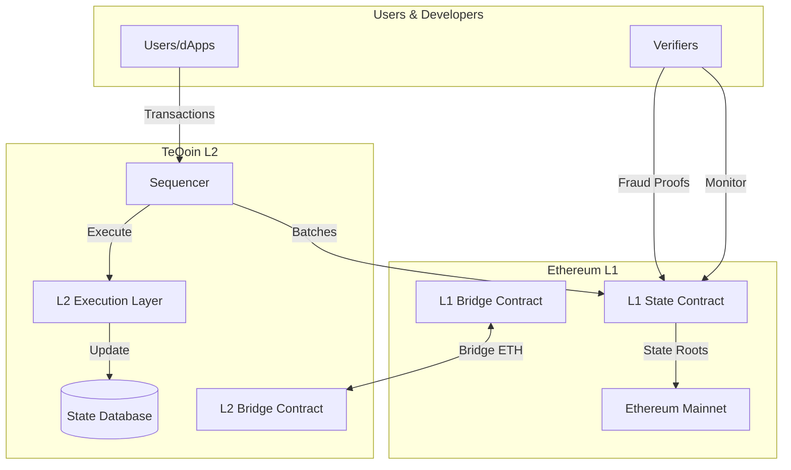
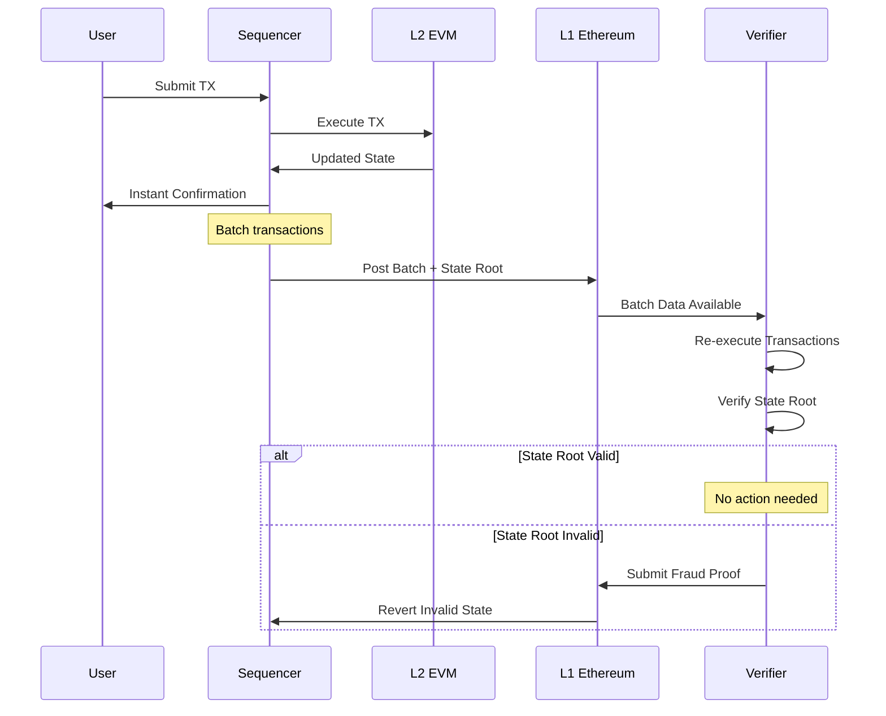

# TeQoin Technical Overview

A comprehensive look at TeQoin's Layer-2 architecture, components, and how they work together to provide fast, low-fee transactions while maintaining Ethereum's security.

<Note>
**Target Audience:** Developers, researchers, and technical users who want to understand how TeQoin works internally.
</Note>

---

## 🎯 What is TeQoin?

TeQoin is an **Optimistic Rollup** Layer-2 scaling solution built on Ethereum.

### Key Characteristics

| Aspect | Details |
|--------|---------|
| **Type** | Optimistic Rollup |
| **Base Layer** | Ethereum (L1) |
| **EVM Compatibility** | 100% compatible |
| **Block Time** | 5 seconds |
| **Transaction Fees** | Very low (~$0.001) |
| **Finality** | Instant (optimistic) + 7 days (final) |
| **Security** | Inherits from Ethereum |

---

## 🏗️ Architecture Overview

### System Components


### Core Components

<CardGroup cols={2}>
  <Card title="Sequencer" icon="server">
    **Block Production**
    
    - Receives transactions from users
    - Orders and batches transactions
    - Produces L2 blocks every 5 seconds
    - Posts batches to Ethereum L1
  </Card>
  
  <Card title="L2 Execution Layer" icon="microchip">
    **Transaction Processing**
    
    - Executes EVM transactions
    - Maintains L2 state
    - 100% EVM compatible
    - Geth-based execution
  </Card>
  
  <Card title="Bridge Contracts" icon="bridge">
    **L1 ↔ L2 Communication**
    
    - Deposit ETH from L1 to L2
    - Withdraw ETH from L2 to L1
    - Message passing
    - Asset backing (1:1)
  </Card>
  
  <Card title="State Contract (L1)" icon="database">
    **Data Availability**
    
    - Stores transaction batches
    - Records state roots
    - Enables fraud proofs
    - Guarantees data availability
  </Card>
</CardGroup>

---

## 🔄 Transaction Flow

### User Transaction Lifecycle

<Steps>
  <Step title="User Submits Transaction">
    User sends transaction to the sequencer via RPC endpoint
```javascript
    // User's wallet sends transaction
    const tx = await signer.sendTransaction({
      to: recipient,
      value: ethers.parseEther('0.1')
    });
```
  </Step>
  
  <Step title="Sequencer Receives & Orders">
    Sequencer receives transaction and adds it to the mempool
    
    - Validates transaction format
    - Checks signature
    - Orders by gas price (if needed) or FIFO
  </Step>
  
  <Step title="Execution on L2">
    Transaction is executed in the next L2 block (~5 seconds)
    
    - EVM executes transaction
    - State is updated
    - Receipt is generated
    - User gets confirmation (instant)
  </Step>
  
  <Step title="Batching">
    Sequencer batches multiple transactions together
    
    - Collects transactions over time window (e.g., 10 minutes)
    - Compresses transaction data
    - Creates batch with hundreds/thousands of TXs
  </Step>
  
  <Step title="Posting to L1">
    Batch is posted to Ethereum L1
    
    - Transaction data posted to L1 calldata
    - State root committed
    - Data becomes publicly available
  </Step>
  
  <Step title="L1 Finalization">
    After 7-day challenge period, transaction is final
    
    - No fraud proofs submitted = valid
    - Withdrawal can be finalized
    - Transaction is permanently settled
  </Step>
</Steps>

---

## 📊 Data Flow

### How Data Moves Through the System


---

## 🔐 Security Model

### Layered Security Approach

<Tabs>
  <Tab title="Layer 1: Data Availability">
    **All data on Ethereum L1**
    
    Every transaction's data is posted to Ethereum:
    - Transaction inputs
    - Signatures
    - State transitions
    
    **Why this matters:**
    - Anyone can reconstruct L2 state from L1 data
    - No data can be hidden or censored
    - If sequencer disappears, users can recover funds
    
    **Cost optimization:**
    - Data is compressed before posting
    - Batching reduces per-transaction cost
    - Calldata is cheaper than storage
  </Tab>
  
  <Tab title="Layer 2: Fraud Proofs">
    **Challenge period for verification**
    
    After state roots are posted:
    - 7-day challenge window opens
    - Anyone can verify state is correct
    - If fraud detected, submit proof to L1
    - Invalid states are reverted
    
    **Economic incentives:**
    - Challengers earn rewards
    - Malicious sequencer loses stake
    - Rational actors verify for profit
    
    [Learn more about fraud proofs →](/architecture/fraud-proofs)
  </Tab>
  
  <Tab title="Layer 3: Smart Contract Security">
    **Battle-tested contracts**
    
    L1 contracts provide:
    - ETH custody for bridge
    - State root validation
    - Fraud proof verification
    - Withdrawal finalization
    
    **Security measures:**
    - Audited by multiple firms
    - Open-source code
    - Gradual rollout
    - Emergency pause mechanisms
  </Tab>
  
  <Tab title="Layer 4: Decentralization">
    **Multiple participants**
    
    System relies on:
    - Sequencer (currently centralized, decentralizing)
    - Multiple verifiers (anyone can run)
    - L1 Ethereum validators
    - User nodes (can verify independently)
    
    **No single point of failure:**
    - Even malicious sequencer can't steal funds
    - Multiple verifiers watch for fraud
    - Users can force transactions via L1
  </Tab>
</Tabs>

---

## ⚙️ Key Technical Specifications

### Network Parameters

| Parameter | Value | Purpose |
|-----------|-------|---------|
| **Chain ID** | 420377 | Network identifier |
| **Block Time** | 5 seconds | Time between blocks |
| **Block Gas Limit** | 30,000,000 | Maximum gas per block |
| **Batch Interval** | ~10 minutes | How often batches post to L1 |
| **Challenge Period** | 7 days | Fraud proof window |
| **EVM Version** | Shanghai | Ethereum compatibility |

### Performance Metrics

| Metric | TeQoin L2 | Ethereum L1 | Improvement |
|--------|-----------|-------------|-------------|
| **Block Time** | 5 seconds | 12 seconds | 2.4x faster |
| **TPS** | 1000+ | 15-30 | 50x+ more |
| **Finality (Soft)** | 5 seconds | 12 seconds | 2.4x faster |
| **Finality (Hard)** | 7 days | 15 minutes | Slower (trade-off) |
| **Gas Cost** | ~$0.001/tx | $5-50/tx | 5000x+ cheaper |

---

## 🧩 Component Deep Dives

<CardGroup cols={2}>
  <Card title="Optimistic Rollup" icon="layer-group" href="/architecture/optimistic-rollup">
    How optimistic rollups enable scaling while maintaining security
  </Card>
  
  <Card title="Fraud Proofs" icon="shield-halved" href="/architecture/fraud-proofs">
    Fraud detection and prevention system
  </Card>
  
  <Card title="Sequencer" icon="server" href="/architecture/sequencer">
    Block production and transaction ordering
  </Card>
  
  <Card title="Security Model" icon="lock" href="/architecture/security-model">
    Complete security analysis and threat model
  </Card>
</CardGroup>

---

## 💡 Design Philosophy

### Core Principles

<AccordionGroup>
  <Accordion title="1. Security First">
    **Never compromise on security for performance**
    
    - All data on L1 (data availability)
    - Fraud proofs for verification
    - 7-day challenge period (no shortcuts)
    - Inherit Ethereum's security guarantees
    
    Trade-offs accepted:
    - Slower withdrawals (7 days) for security
    - Higher L1 costs for data availability
  </Accordion>
  
  <Accordion title="2. EVM Equivalence">
    **100% compatible with Ethereum**
    
    - Same opcodes
    - Same precompiles
    - Same gas costs
    - Same developer tools
    
    Benefits:
    - Zero migration effort
    - Familiar development experience
    - Reuse existing contracts
    - Compatible with all Ethereum tooling
  </Accordion>
  
  <Accordion title="3. Decentralization Path">
    **Start centralized, move to decentralized**
    
    Current state:
    - Centralized sequencer (for simplicity)
    - Decentralized verification (anyone can challenge)
    
    Future plans:
    - Decentralized sequencer set
    - Proposer selection mechanism
    - MEV-resistant ordering
  </Accordion>
  
  <Accordion title="4. User Experience">
    **Make it feel like Ethereum, but better**
    
    - Instant confirmations (5 seconds)
    - Low fees (near-zero)
    - Same wallet experience
    - MetaMask compatibility
    
    No compromises on UX for technical purity.
  </Accordion>
</AccordionGroup>

---

## 🆚 Comparison with Other Solutions

### TeQoin vs Other Scaling Approaches

| Feature | TeQoin (Optimistic) | ZK Rollup | Sidechain | State Channel |
|---------|---------------------|-----------|-----------|---------------|
| **Security** | Ethereum-grade | Ethereum-grade | Lower | High (limited) |
| **Withdrawal Time** | 7 days | Hours | Instant | Instant |
| **EVM Compatibility** | 100% | Varies | 100% | Limited |
| **Transaction Cost** | Very Low | Low | Very Low | Near-zero |
| **Throughput** | High | High | Very High | Unlimited |
| **Complexity** | Medium | High | Low | Medium |
| **Proving Cost** | Low | High | None | None |

**Why Optimistic Rollup?**
- ✅ Best balance of security and cost
- ✅ Full EVM compatibility
- ✅ Lower operational costs than ZK
- ✅ Proven technology (Optimism, Arbitrum)

---

## 📈 Scalability Analysis

### How TeQoin Achieves 1000+ TPS

**Technique #1: Off-chain Execution**
```
Ethereum L1: Execute on-chain
TeQoin L2: Execute off-chain, post results

Cost Savings: 100x+ cheaper execution
```

**Technique #2: Batch Compression**
```
Individual TXs on L1: ~180 bytes each
Batched TXs on L2: ~12 bytes each (compressed)

Data Savings: 15x compression
```

**Technique #3: Calldata Optimization**
```
Using calldata (cheap) instead of storage (expensive)

Cost Reduction: 10x cheaper per byte
```

**Combined Effect:**
```
Total Scalability: 100x (execution) × 15x (compression) × 10x (calldata)
                  ≈ 15,000x cost reduction
                  ≈ 1000+ TPS (vs. 15-30 on L1)
```

---

## 🔮 Future Enhancements

### Roadmap Items

<Tabs>
  <Tab title="Short Term (3-6 months)">
    **Performance & Features:**
    - ✅ ERC-20 token bridging
    - ✅ ERC-721 NFT support
    - 🔄 Improved batch compression
    - 🔄 Multi-call optimizations
    
    **Infrastructure:**
    - 🔄 Additional RPC endpoints
    - 🔄 Enhanced block explorer
    - 🔄 Better monitoring tools
  </Tab>
  
  <Tab title="Medium Term (6-12 months)">
    **Decentralization:**
    - Decentralized sequencer set
    - Multi-sequencer rotation
    - Proposer selection mechanism
    
    **Advanced Features:**
    - Native account abstraction
    - Cross-L2 communication
    - Improved fraud proof system
  </Tab>
  
  <Tab title="Long Term (12+ months)">
    **Next-Gen Tech:**
    - ZK fraud proofs (faster finality)
    - Sharded execution
    - Parallel transaction processing
    
    **Ecosystem:**
    - Native DeFi protocols
    - L2-native DEX
    - Governance system
  </Tab>
</Tabs>

---

## 🛠️ For Developers

### Building on TeQoin

<CardGroup cols={2}>
  <Card title="Network Information" icon="network-wired" href="/developers/network-information">
    RPC endpoints, chain ID, and network parameters
  </Card>
  
  <Card title="Deploy Contracts" icon="rocket" href="/developers/deploy-contract">
    Deploy your smart contracts to TeQoin L2
  </Card>
  
  <Card title="Integration Guide" icon="plug" href="/developers/integration-guide">
    Integrate TeQoin into your dApp
  </Card>
  
  <Card title="Smart Contracts" icon="file-code" href="/developers/smart-contracts">
    Write contracts for TeQoin L2
  </Card>
</CardGroup>

---

## 📚 Technical Resources

### Further Reading

<CardGroup cols={2}>
  <Card title="Optimistic Rollup Specs" icon="book" href="/architecture/optimistic-rollup">
    Detailed optimistic rollup mechanics
  </Card>
  
  <Card title="Fraud Proof System" icon="shield" href="/architecture/fraud-proofs">
    How fraud proofs work
  </Card>
  
  <Card title="Sequencer Design" icon="server" href="/architecture/sequencer">
    Block production and ordering
  </Card>
  
  <Card title="Security Analysis" icon="lock" href="/architecture/security-model">
    Comprehensive security model
  </Card>
</CardGroup>

### External Resources

- **Ethereum.org:** https://ethereum.org/en/developers/docs/scaling/
- **Optimism Specs:** https://github.com/ethereum-optimism/specs
- **Rollup Research:** https://l2beat.com

---

## 🎓 Academic Background

### Research Papers

<AccordionGroup>
  <Accordion title="Optimistic Rollup Fundamentals">
    **Key Papers:**
    
    1. "Arbitrum: Scalable, private smart contracts" (Kalodner et al., 2018)
    2. "Optimistic vs. ZK Rollup: Deep Dive" (StarkWare, 2021)
    3. "A rollup-centric ethereum roadmap" (Vitalik Buterin, 2020)
    
    **Core Concepts:**
    - Optimistic execution
    - Fraud proof construction
    - Data availability guarantees
    - Economic security model
  </Accordion>
  
  <Accordion title="State Channels & Plasma">
    **Historical Context:**
    
    TeQoin's design builds on lessons from:
    - State channels (Lightning Network, Raiden)
    - Plasma (Plasma MVP, Plasma Cash)
    - Validium (off-chain data)
    
    **Why Optimistic Rollups Won:**
    - Better data availability than Plasma
    - Higher throughput than state channels
    - Simpler than ZK rollups
    - Full EVM compatibility
  </Accordion>
</AccordionGroup>

---

## 🔬 System Invariants

### Guaranteed Properties

TeQoin maintains these invariants:

1. **Conservation of Funds**
```
   ∀ time t: ETH_on_L2(t) ≤ ETH_locked_on_L1(t)
```
   L2 ETH never exceeds L1 backing

2. **Data Availability**
```
   ∀ L2_block: transaction_data ∈ L1_calldata
```
   All transaction data on L1

3. **State Validity**
```
   ∀ state_root: ∃ fraud_proof ⟹ state_reverted
```
   Invalid states can be proven and reverted

4. **Liveness**
```
   Users_can_force_include_transactions_via_L1
```
   Censorship resistance guarantee

---

**Ready to dive deeper?** Continue to [Optimistic Rollup Details](/architecture/optimistic-rollup) →