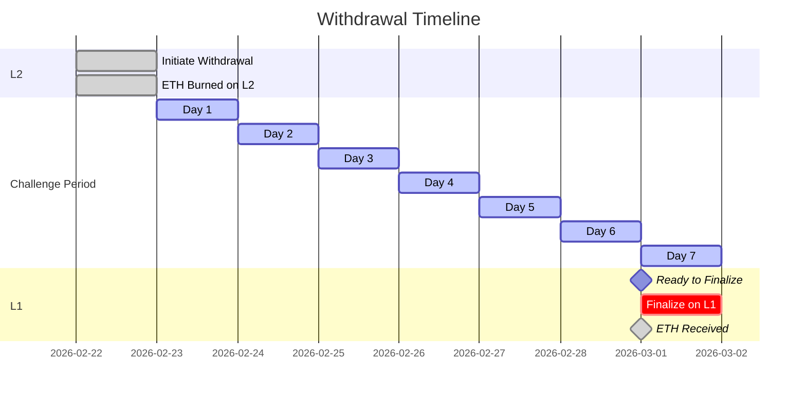

# Challenge Period Explained

Learn why withdrawals from TeQoin L2 to Ethereum require a 7-day waiting period, and how this ensures your funds are always safe.

<Note>
**TL;DR:**

The 7-day challenge period is a **security feature** that protects your funds by allowing time to detect and prove fraud. It's not a limitation—it's what makes TeQoin trustless and secure without relying on centralized parties.
</Note>

---

## 🤔 What is the Challenge Period?

The **challenge period** is a 7-day waiting time between when you initiate a withdrawal on L2 and when you can finalize it on L1.

### Timeline


**Day 0:** Initiate withdrawal on L2  
**Days 1-7:** Challenge period (waiting)  
**Day 7+:** Finalize withdrawal on L1  

---

## 🎯 Why Does It Exist?

### The Problem It Solves

Optimistic rollups like TeQoin assume transactions are valid by default. But what if someone tries to cheat?

**Without a challenge period:**
```
❌ Malicious sequencer submits invalid withdrawal
❌ Withdrawal processes immediately
❌ Funds are stolen before anyone can react
❌ No way to stop it
```

**With a 7-day challenge period:**
```
✅ Malicious sequencer submits invalid withdrawal
✅ 7-day window opens
✅ Anyone can detect and challenge it
✅ Fraud proof submitted to L1
✅ Invalid withdrawal is blocked
✅ Funds are safe
```

### Real-World Analogy

Think of it like a bank check:

**Bank Check (Traditional):**
- You write a check
- Bank holds it for 3-5 business days
- Time for bank to verify funds exist
- Protects against fraud

**TeQoin Withdrawal (Blockchain):**
- You initiate withdrawal
- Bridge holds it for 7 days
- Time for network to verify it's valid
- Protects against invalid transactions

---

## 🔐 How It Provides Security

### Optimistic Rollup Model

<Steps>
  <Step title="Optimistic Assumption">
    Transactions are assumed to be valid by default.
    
    **Benefit:** Fast processing, low cost
    
    **Trade-off:** Need time to verify if challenged
  </Step>
  
  <Step title="Anyone Can Verify">
    During the 7-day period, anyone can:
    
    - Download L2 transaction data from L1
    - Re-execute transactions independently
    - Verify the state is correct
    - Submit fraud proof if something is wrong
    
    **This is decentralized security!**
  </Step>
  
  <Step title="Fraud Proofs">
    If someone detects invalid data:
    
    1. They submit a fraud proof to L1
    2. L1 smart contract verifies the proof
    3. If proof is valid, invalid withdrawal is reverted
    4. Challenger earns a reward
    5. Malicious actor is penalized
    
    **Your funds are protected by math and code, not trust.**
  </Step>
  
  <Step title="Automatic Protection">
    You don't need to do anything:
    
    - Multiple parties monitor the network
    - Automated systems check for fraud
    - Economic incentives ensure verification
    - If fraud occurs, it's caught and stopped
    
    **Security is built-in and automatic.**
  </Step>
</Steps>

---

## 📊 Challenge Period in Action

### What Happens During 7 Days?

<Tabs>
  <Tab title="Your Withdrawal">
    **Your perspective:**
```
    Day 0:  Initiate withdrawal on L2
           ✅ Transaction confirmed (~5 seconds)
           🔥 Your L2 ETH is burned
           📝 Withdrawal recorded in bridge
    
    Days 1-6: Wait
           ⏰ Challenge period active
           💤 Nothing to do - just wait
           📊 Track progress on bridge interface
    
    Day 7:  Ready to finalize
           ✅ Challenge period complete
           🔓 Can finalize on L1 anytime
           💰 Receive your ETH on L1
```
  </Tab>
  
  <Tab title="Network Activity">
    **What the network does:**
```
    Day 0:  Sequencer processes withdrawal
           📤 Posts state root to L1
           🔗 Includes withdrawal in batch
    
    Days 1-7: Verification period
           👀 Watchers monitor state roots
           🔍 Verifiers check transaction validity
           🤖 Automated systems scan for fraud
           💻 Full nodes re-execute transactions
           ✅ Everything checks out (normal case)
    
    Day 7:  Finalization enabled
           🔓 Withdrawal proven valid
           ✅ Ready for user to claim on L1
```
  </Tab>
  
  <Tab title="If Fraud Detected">
    **Fraud prevention in action:**
```
    Day 0:  Malicious withdrawal submitted
           🚨 Invalid state root posted
    
    Day 2:  Verifier detects fraud
           🔍 Re-executes transactions
           ❌ State doesn't match
           📝 Prepares fraud proof
    
    Day 3:  Fraud proof submitted
           📤 Proof sent to L1 contract
           ⚖️ L1 contract verifies proof
           ✅ Proof is valid
    
    Day 3:  Fraud prevented
           ⛔ Invalid withdrawal blocked
           🏆 Challenger rewarded
           💰 Malicious actor penalized
           ✅ Other withdrawals unaffected
```
    
    **Your legitimate withdrawal is safe!**
  </Tab>
</Tabs>

---

## 💡 Why 7 Days Specifically?

### The Calculation

| Factor | Consideration |
|--------|---------------|
| **Detection Time** | Need enough time for independent verifiers to notice fraud |
| **Proof Generation** | Time to compute and submit fraud proofs |
| **Network Diversity** | Different time zones, various verification setups |
| **Safety Margin** | Extra buffer for unexpected delays |
| **Emergency Response** | Time for community to coordinate if needed |

**7 days balances:**
- ✅ Strong security (enough time to catch fraud)
- ✅ Reasonable UX (not too long to wait)
- ✅ Industry standard (same as Optimism, Arbitrum)

### Could It Be Shorter?

**Technically yes, but:**

- ❌ Less time = less security
- ❌ Harder for independent verification
- ❌ More centralization required
- ❌ Higher risk of successful fraud

**7 days is the sweet spot** that the industry has converged on through research and experience.

---

## 🆚 Comparison with Other L2s

### Industry Standard

| L2 Solution | Challenge Period | Technology |
|-------------|------------------|------------|
| **TeQoin** | 7 days | Optimistic Rollup |
| **Optimism** | 7 days | Optimistic Rollup |
| **Arbitrum** | 7 days | Optimistic Rollup |
| **Base** | 7 days | Optimistic Rollup |
| **zkSync** | ~Hours | ZK Rollup (no challenge needed) |
| **Polygon zkEVM** | ~Hours | ZK Rollup (no challenge needed) |

<Note>
**Why do ZK rollups not need challenge periods?**

ZK (zero-knowledge) rollups use cryptographic proofs that are verified instantly on L1. They're mathematically proven correct, so no challenge period is needed.

**Trade-offs:**
- ZK: Faster withdrawals, higher complexity, more expensive proving
- Optimistic: 7-day withdrawals, simpler, cheaper operations

TeQoin chose optimistic rollups for lower fees and simpler development.
</Note>

---

## 🤷 Common Misconceptions

<AccordionGroup>
  <Accordion title="Misconception: 'The 7 days is a technical limitation'">
    **Reality:** It's a deliberate security feature, not a technical constraint.
    
    TeQoin could process withdrawals instantly from a technical perspective, but that would require trusting the sequencer. The 7-day period enables **trustless** security.
    
    **It's a feature, not a bug!**
  </Accordion>
  
  <Accordion title="Misconception: 'My funds are locked up during the 7 days'">
    **Reality:** Your funds are secured by L1 smart contracts during the challenge period.
    
    - Your L2 ETH was already burned (can't be double-spent)
    - Your L1 ETH is reserved in the bridge (can't be taken)
    - The challenge period is verification time, not a "lock"
    
    **Your funds are safe and accounted for.**
  </Accordion>
  
  <Accordion title="Misconception: 'I need to actively watch my withdrawal'">
    **Reality:** The network automatically protects you.
    
    You don't need to:
    - Monitor your withdrawal
    - Submit proofs yourself
    - Defend against challenges
    - Do anything during the 7 days
    
    Just initiate, wait 7 days, finalize. That's it!
  </Accordion>
  
  <Accordion title="Misconception: 'Challenge period means the system is insecure'">
    **Reality:** It's the opposite—the challenge period IS the security.
    
    Without it:
    - You'd have to trust the sequencer completely
    - No way to prove fraud
    - Centralized control
    
    With it:
    - Trustless verification
    - Decentralized security
    - Provable correctness
    
    **The challenge period makes TeQoin MORE secure.**
  </Accordion>
  
  <Accordion title="Misconception: 'It should be instant like deposits'">
    **Reality:** Deposits and withdrawals have different security models.
    
    **Deposits (L1 → L2):**
    - Ethereum L1 is the source of truth
    - L1 transaction is final when confirmed
    - Safe to credit on L2 immediately
    - **Fast: ~15 minutes**
    
    **Withdrawals (L2 → L1):**
    - L2 is claiming from L1
    - Need to verify L2 state is correct
    - Challenge period ensures validity
    - **Secure: 7 days**
    
    **Different directions, different security needs.**
  </Accordion>
</AccordionGroup>

---

## ⚡ Can I Avoid the Challenge Period?

### Official Bridge: No

The official TeQoin bridge **always requires 7 days** for security. This cannot be bypassed.

### Third-Party Bridges: Yes (with trade-offs)

Some third-party services offer "fast withdrawals":

<Tabs>
  <Tab title="How They Work">
    **Liquidity Provider Model:**
    
    1. You initiate withdrawal on L2
    2. Liquidity provider gives you ETH immediately on L1
    3. Provider waits 7 days to claim your withdrawal
    4. You pay a fee for the instant liquidity
    
    **You're essentially selling your withdrawal to someone willing to wait.**
  </Tab>
  
  <Tab title="Pros & Cons">
    **Pros:**
    - ⚡ Instant L1 ETH (minutes, not days)
    - 🎯 Good for emergencies
    - 💼 Useful for traders
    
    **Cons:**
    - 💰 Fee (typically 0.1-1% of amount)
    - 🔒 Less secure (trust third party)
    - 📉 May have liquidity limits
    - 🚫 Not always available
  </Tab>
  
  <Tab title="Examples">
    **Common fast bridge providers:**
    
    - Across Protocol
    - Hop Protocol
    - Connext
    - Celer cBridge
    
    <Warning>
    **Use at your own risk!**
    
    These are third-party services:
    - Not endorsed by TeQoin
    - Additional smart contract risk
    - Potential for hacks/exploits
    - Always DYOR (Do Your Own Research)
    
    Official bridge = Safest option
    </Warning>
  </Tab>
</Tabs>

---

## 🎓 Technical Deep Dive

### For Developers and Technical Users

<AccordionGroup>
  <Accordion title="State Root Commitments">
    **How L2 state is committed to L1:**
    
    1. Sequencer batches L2 transactions
    2. Computes new state root (Merkle root)
    3. Posts state root to L1 every ~X hours
    4. State root represents all L2 account balances
    
    **Challenge period allows verification that state root is correct.**
```solidity
    // Simplified L1 contract
    mapping(uint256 => bytes32) public stateRoots;
    mapping(uint256 => uint256) public stateRootTimestamps;
    
    function submitStateRoot(bytes32 _stateRoot) external onlySequencer {
        uint256 index = stateRootIndex++;
        stateRoots[index] = _stateRoot;
        stateRootTimestamps[index] = block.timestamp;
    }
    
    function finalizeWithdrawal(/* params */) external {
        require(
            block.timestamp >= stateRootTimestamps[index] + 7 days,
            "Challenge period not complete"
        );
        // Process withdrawal
    }
```
  </Accordion>
  
  <Accordion title="Fraud Proof System">
    **How fraud is detected and proven:**
    
    **Detection:**
    1. Verifier downloads transaction batch from L1
    2. Re-executes transactions locally
    3. Computes expected state root
    4. Compares with sequencer's posted state root
    5. If mismatch → fraud detected
    
    **Proof:**
    1. Verifier identifies fraudulent transaction
    2. Generates Merkle proof showing discrepancy
    3. Submits fraud proof to L1 contract
    4. L1 contract re-executes single transaction
    5. Verifies fraud proof is correct
    6. Slashes sequencer, rewards challenger
    
    **Economic incentive ensures monitoring happens.**
  </Accordion>
  
  <Accordion title="Withdrawal Process Internals">
    **Under the hood:**
```
    L2 Initiation:
    1. User calls L2Bridge.initiateWithdrawal(amount)
    2. L2 burns user's ETH
    3. Emits WithdrawalInitiated event
    4. Event included in L2 block
    5. Block data posted to L1
    
    L1 Finalization:
    1. User calls L1Bridge.finalizeWithdrawal(proof)
    2. Contract verifies 7 days passed
    3. Contract verifies Merkle proof
    4. Contract unlocks ETH from L1 bridge
    5. ETH sent to user's L1 address
```
    
    The Merkle proof connects the L2 event to the L1 state root, proving the withdrawal is legitimate.
  </Accordion>
</AccordionGroup>

---

## 💭 Philosophy: Security vs. Convenience

### The Trade-off
```
┌─────────────────────────────────────┐
│  Fast Withdrawals (Instant)         │
│                                     │
│  ❌ Must trust sequencer            │
│  ❌ Centralized control             │
│  ❌ No fraud protection             │
│  ❌ Risk of fund loss               │
└─────────────────────────────────────┘

            vs.

┌─────────────────────────────────────┐
│  Secure Withdrawals (7 days)        │
│                                     │
│  ✅ Trustless verification          │
│  ✅ Decentralized security          │
│  ✅ Fraud proof protection          │
│  ✅ Guaranteed fund safety          │
└─────────────────────────────────────┘
```

**TeQoin chose security.**

---

## 📌 Key Takeaways

<CardGroup cols={2}>
  <Card title="Security Feature" icon="shield-check">
    The 7-day period is a **security feature**, not a limitation
  </Card>
  
  <Card title="Trustless" icon="handshake-slash">
    Enables **trustless** operation without relying on centralized parties
  </Card>
  
  <Card title="Automatic" icon="robot">
    Protection is **automatic** - you don't need to do anything
  </Card>
  
  <Card title="Industry Standard" icon="certificate">
    7 days is the **standard** for all major optimistic rollups
  </Card>
  
  <Card title="Fraud Prevention" icon="shield-halved">
    Allows time to detect and **prove fraud** if it occurs
  </Card>
  
  <Card title="Your Funds Are Safe" icon="lock">
    During challenge period, your funds are **secured by L1 contracts**
  </Card>
</CardGroup>

---

## 🎯 Practical Implications

### For Users

<Tip>
**Plan Ahead**

- Need L1 funds? Start withdrawal 7 days early
- Keep some ETH on both L1 and L2
- Don't wait until you urgently need funds
- Use third-party bridges only for emergencies
</Tip>

### For Developers

<Tip>
**Design Around It**

- Don't promise instant L2 → L1 transfers
- Educate users about the 7-day period
- Consider L2-native solutions where possible
- Use deposits (L1 → L2) when speed matters
</Tip>

---

## 📚 Learn More

<CardGroup cols={2}>
  <Card title="Withdrawal Guide" icon="arrow-up" href="/bridge/withdraw-l2-to-l1">
    Complete guide to withdrawing from L2 to L1
  </Card>
  
  <Card title="Bridge FAQ" icon="circle-question" href="/bridge/faq">
    Common questions about the bridge
  </Card>
  
  <Card title="Security Model" icon="shield" href="/architecture/security-model">
    Technical details on TeQoin's security
  </Card>
  
  <Card title="Optimistic Rollup" icon="layer-group" href="/architecture/optimistic-rollup">
    How optimistic rollups work
  </Card>
</CardGroup>

---

**Understand the challenge period?** Ready for [Bridge FAQ](/bridge/faq) →