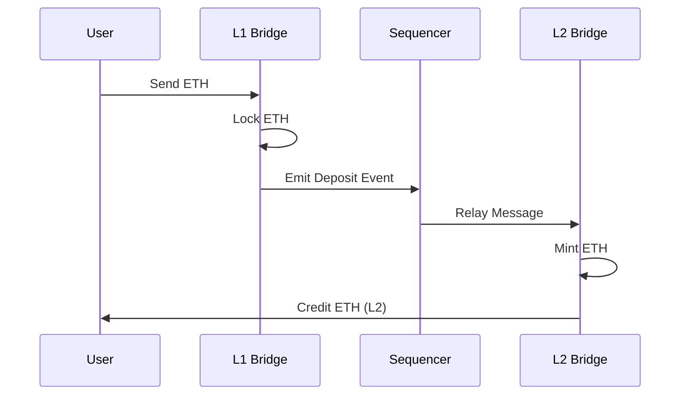

# Deposit ETH from L1 to L2

Transfer ETH from Ethereum mainnet to TeQoin L2 quickly and safely.

<Note>
**Quick Facts:**
- ⏱️ **Time:** ~15 minutes
- 💰 **L1 Gas Fee:** $10-50 (varies with Ethereum gas price)
- 💰 **L2 Fee:** $0 (covered by bridge)
- 🔄 **Ratio:** 1 ETH on L1 = 1 ETH on L2
- ✅ **Cancellable:** No (irreversible once confirmed)
</Note>

---

## 📋 Prerequisites

Before you start, make sure you have:

<Steps>
  <Step title="ETH on Ethereum L1">
    You need ETH on Ethereum mainnet to deposit.
    
    **Minimum recommended:** 0.01 ETH (to cover gas + deposit amount)
  </Step>
  
  <Step title="Wallet with L1 Connection">
    - MetaMask installed and connected to **Ethereum Mainnet**
    - Or TeQoin Telegram Wallet
    - Sufficient ETH for gas fees + deposit amount
  </Step>
  
  <Step title="TeQoin L2 Added to Wallet">
    Add TeQoin L2 network to receive funds
    
    [Add Network Guide →](/quickstart/add-network)
  </Step>
</Steps>

---

## 🌉 How Deposits Work

### The Process


**Step-by-step:**

1. **You send ETH** to L1 bridge contract
2. **ETH is locked** on Ethereum L1
3. **Bridge emits event** that sequencer monitors
4. **Sequencer relays** message to L2
5. **L2 mints equivalent ETH** (1:1 ratio)
6. **You receive ETH** on TeQoin L2

**Total time:** ~15 minutes

---

## 🎯 Step-by-Step Guide

### Method 1: Bridge Interface (Recommended)

<Steps>
  <Step title="Visit the Bridge">
    Go to the official TeQoin bridge:
    
    **🔗 https://bridge.teqoin.io**
    
    <Warning>
    **Security Alert:** Always verify you're on the official bridge URL. Bookmark it to avoid phishing sites.
    </Warning>
  </Step>
  
  <Step title="Connect Wallet">
    1. Click **"Connect Wallet"**
    2. Select your wallet (MetaMask, WalletConnect, etc.)
    3. Approve the connection
    
    **Important:** Make sure you're connected to **Ethereum Mainnet** (not a testnet)
    
    <Tip>
    Check the network indicator in your wallet. It should show "Ethereum Mainnet" or "Mainnet".
    </Tip>
  </Step>
  
  <Step title="Select Deposit Tab">
    Click the **"Deposit"** or **"L1 → L2"** tab
    
    The interface should show:
    - From: Ethereum Mainnet
    - To: TeQoin L2
  </Step>
  
  <Step title="Enter Amount">
    Enter the amount of ETH you want to deposit
    
    **Examples:**
    - `0.1` - Deposit 0.1 ETH
    - `1.5` - Deposit 1.5 ETH
    - Click **"Max"** to deposit all available ETH (minus gas)
    
    <Note>
    **Recommended minimum:** 0.01 ETH
    
    This ensures the deposit is worthwhile considering L1 gas fees.
    </Note>
  </Step>
  
  <Step title="Review Transaction Details">
    The bridge will show:
    
    | Detail | Information |
    |--------|-------------|
    | **Amount to Deposit** | ETH you're sending |
    | **You'll Receive** | Same amount on L2 |
    | **L1 Gas Fee** | Ethereum transaction cost |
    | **Estimated Time** | ~15 minutes |
    | **Bridge Fee** | $0 (no bridge fee) |
    
    Review carefully and make sure everything is correct.
  </Step>
  
  <Step title="Approve Transaction">
    1. Click **"Deposit"** or **"Bridge ETH"**
    2. MetaMask popup appears
    3. Review transaction in MetaMask:
       - **To:** L1 Bridge Contract (`0x919aa27d5278BC98bf40BA5A79be468B91f061dA`)
       - **Amount:** Your deposit amount
       - **Gas Fee:** Ethereum L1 gas cost
    4. Click **"Confirm"** in MetaMask
    
    <Warning>
    **Double-check the contract address!**
    
    L1 Bridge: `0x919aa27d5278BC98bf40BA5A79be468B91f061dA`
    
    If it's different, DO NOT proceed!
    </Warning>
  </Step>
  
  <Step title="Wait for L1 Confirmation">
    Your transaction is submitted to Ethereum:
    
    - **Status:** Pending
    - **Time:** 2-5 minutes (depends on gas price)
    - **Confirmations:** Wait for ~12 confirmations
    
    You'll see:
    - Transaction hash
    - Pending status indicator
    - Link to view on Etherscan
    
    <Tip>
    Click the transaction hash to track it on Etherscan in real-time.
    </Tip>
  </Step>
  
  <Step title="Automatic L2 Processing">
    Once L1 transaction confirms:
    
    1. Bridge detects the deposit event
    2. Sequencer processes the deposit
    3. L2 bridge mints equivalent ETH
    4. ETH appears in your L2 wallet
    
    **Time:** 5-10 minutes after L1 confirmation
    
    The bridge interface shows:
    - ✅ L1 transaction confirmed
    - 🔄 Processing on L2
    - ⏳ Waiting for L2 credit
  </Step>
  
  <Step title="Verify on L2">
    After ~15 minutes total:
    
    1. Switch to **TeQoin L2** network in your wallet
    2. Check your balance - it should have increased
    3. View transaction on https://explorer.teqoin.io
    
    ✅ **Deposit Complete!** You now have ETH on TeQoin L2.
  </Step>
</Steps>

---

### Method 2: Direct Contract Interaction (Advanced)

For developers or advanced users who want to interact with the contract directly.

<CodeGroup>
```javascript Ethers.js
import { ethers } from 'ethers';

// Connect to Ethereum L1
const provider = new ethers.BrowserProvider(window.ethereum);
const signer = await provider.getSigner();

// L1 Bridge contract
const L1_BRIDGE = '0x919aa27d5278BC98bf40BA5A79be468B91f061dA';
const bridgeABI = [
  'function depositETH() payable'
];

const bridge = new ethers.Contract(L1_BRIDGE, bridgeABI, signer);

// Deposit 0.1 ETH
const tx = await bridge.depositETH({
  value: ethers.parseEther('0.1')
});

console.log('Deposit transaction:', tx.hash);

// Wait for confirmation
const receipt = await tx.wait();
console.log('Confirmed in block:', receipt.blockNumber);

// Switch to L2 and check balance after ~15 minutes
```
```javascript Web3.js
const Web3 = require('web3');

// Connect to Ethereum L1
const web3 = new Web3(window.ethereum);

// Request account access
await window.ethereum.request({ method: 'eth_requestAccounts' });
const accounts = await web3.eth.getAccounts();

// L1 Bridge contract
const L1_BRIDGE = '0x919aa27d5278BC98bf40BA5A79be468B91f061dA';
const bridgeABI = [/* ABI */];

const bridge = new web3.eth.Contract(bridgeABI, L1_BRIDGE);

// Deposit 0.1 ETH
const tx = await bridge.methods.depositETH().send({
  from: accounts[0],
  value: web3.utils.toWei('0.1', 'ether')
});

console.log('Deposit transaction:', tx.transactionHash);
```
```bash Cast (Foundry)
# Using Foundry's cast command

# Deposit 0.1 ETH to L2
cast send 0x919aa27d5278BC98bf40BA5A79be468B91f061dA \
  "depositETH()" \
  --value 0.1ether \
  --rpc-url https://eth-mainnet.g.alchemy.com/v2/YOUR_KEY \
  --private-key $PRIVATE_KEY

# Transaction will be sent to Ethereum L1
# Wait ~15 minutes and check L2 balance
```
</CodeGroup>

---

## 💰 Cost Breakdown

### Example: Deposit 1 ETH
```
Amount to Deposit:           1.0 ETH
─────────────────────────────────────
L1 Gas Fee (variable):      ~0.005 ETH ($10-20)
L2 Processing Fee:           0 ETH (free)
Bridge Fee:                  0 ETH (no fee)
─────────────────────────────────────
Total Cost:                 ~0.005 ETH
You Receive on L2:           1.0 ETH

Effective Cost:             ~0.5% (gas only)
```

### Gas Price Optimization

<Tabs>
  <Tab title="When to Bridge">
    **Cheapest times (Ethereum gas is low):**
    - 🌙 Late night (2-6 AM US Eastern Time)
    - 📅 Weekends (Saturday-Sunday)
    - 🏖️ Holidays
    
    **Most expensive times:**
    - 📈 Weekday afternoons (US trading hours)
    - 🚀 During NFT mints or major events
    - ⏰ Peak DeFi activity hours
    
    **Check current gas prices:**
    - https://etherscan.io/gastracker
    - https://ethereumprice.org/gas/
  </Tab>
  
  <Tab title="Gas Price Tiers">
    | Gas Price | Cost for Deposit | When to Use |
    |-----------|------------------|-------------|
    | **Low** (10-20 gwei) | $5-10 | ✅ Best time to bridge |
    | **Medium** (20-50 gwei) | $10-25 | 🟡 Acceptable |
    | **High** (50-100 gwei) | $25-50 | 🔴 Wait if possible |
    | **Very High** (100+ gwei) | $50+ | ⛔ Avoid unless urgent |
  </Tab>
  
  <Tab title="Save on Fees">
    **Tips to minimize costs:**
    
    1. **Bridge larger amounts less frequently**
       - Instead of 10 deposits of 0.1 ETH ($100 total gas)
       - Do 1 deposit of 1 ETH ($10 gas)
    
    2. **Use gas price alerts**
       - Set up alerts on Etherscan
       - Get notified when gas is cheap
    
    3. **Be patient**
       - Don't bridge during network congestion
       - Wait for low gas periods
    
    4. **Plan ahead**
       - Bridge when you don't need funds immediately
       - Use slow gas option if not urgent
  </Tab>
</Tabs>

---

## 📊 Tracking Your Deposit

### On the Bridge Interface

The bridge shows deposit status:
```
✅ Step 1: Transaction Submitted
⏳ Step 2: Waiting for L1 Confirmation (2-5 min)
⏳ Step 3: Processing on L2 (5-10 min)
⏳ Step 4: ETH Credited to L2
```

### On Block Explorers

<Tabs>
  <Tab title="Ethereum (L1)">
    **View L1 transaction:**
    
    1. Go to https://etherscan.io
    2. Paste your transaction hash
    3. Verify:
       - ✅ Status: Success
       - ✅ To: L1 Bridge Contract
       - ✅ Value: Your deposit amount
       - ✅ Confirmations: 12+
  </Tab>
  
  <Tab title="TeQoin (L2)">
    **View L2 credit:**
    
    1. Go to https://explorer.teqoin.io
    2. Search your wallet address
    3. Look for:
       - Transaction from L2 Bridge
       - Amount matching your deposit
       - Type: "Deposit from L1"
  </Tab>
</Tabs>

---

## 🔧 Troubleshooting

<AccordionGroup>
  <Accordion title="Deposit stuck on 'Pending' for over 30 minutes">
    **Possible causes:**
    - L1 transaction hasn't confirmed yet
    - Used too low gas price
    - Network congestion on Ethereum
    
    **Solution:**
    1. Check L1 transaction on Etherscan
    2. If still pending on L1:
       - Wait longer (may take hours with low gas)
       - Or speed up with higher gas (MetaMask "Speed Up" option)
    3. If L1 confirmed but not on L2:
       - Wait another 30 minutes
       - Check bridge status page
       - Contact support with TX hash
  </Accordion>
  
  <Accordion title="Transaction failed on L1">
    **Common reasons:**
    - Insufficient ETH for gas
    - Too low gas limit
    - Network error
    
    **Solution:**
    1. Check error message on Etherscan
    2. If "out of gas": Retry with higher gas limit
    3. If "insufficient funds": Add more ETH and retry
    4. Your deposit was NOT processed - funds are still on L1
  </Accordion>
  
  <Accordion title="ETH not showing on L2 after 1 hour">
    L1 confirmed but L2 credit delayed.
    
    **Solution:**
    1. Verify L1 transaction succeeded on Etherscan
    2. Check your L2 wallet address is correct
    3. Make sure you're on TeQoin L2 network
    4. Refresh wallet (disconnect/reconnect)
    5. Check explorer.teqoin.io for incoming transaction
    6. If still missing after 2 hours, contact support
  </Accordion>
  
  <Accordion title="Wrong network - sent on testnet">
    Accidentally used Sepolia or another testnet.
    
    **Solution:**
    - Testnet ETH has no value - this is expected
    - Mainnet and testnet are completely separate
    - For mainnet deposits, connect to Ethereum Mainnet
    - Your funds are not lost, just on the wrong network
  </Accordion>
  
  <Accordion title="Sent ETH directly to bridge contract (not via interface)">
    Manually sent ETH to contract address without calling depositETH().
    
    **Solution:**
    - If you called depositETH(): Should process normally
    - If you sent plain ETH transfer: Funds may be stuck
    - Contact support immediately with transaction hash
    - May be recoverable depending on the situation
    
    **Always use the bridge interface to avoid this!**
  </Accordion>
  
  <Accordion title="Want to cancel deposit">
    **Deposits cannot be cancelled** once the L1 transaction is confirmed.
    
    **Options:**
    - Let it complete (~15 minutes)
    - Once on L2, you can withdraw back to L1 (7 days)
    - Or keep funds on L2 for low-fee transactions
  </Accordion>
</AccordionGroup>

---

## ✅ Post-Deposit Checklist

After your deposit completes:

<Steps>
  <Step title="Verify L2 Balance">
```bash
    1. Switch to TeQoin L2 in wallet
    2. Check balance increased by deposit amount
    3. Note: Balance might not update instantly - refresh wallet
```
  </Step>
  
  <Step title="Save Transaction Records">
```bash
    # Keep these for your records:
    - L1 transaction hash
    - L2 transaction hash
    - Deposit amount
    - Date and time
    - Bridge used
```
  </Step>
  
  <Step title="Start Using L2">
    Now you can:
    - Make low-fee transactions
    - Deploy smart contracts
    - Use TeQoin dApps
    - Trade on DEXs
    
    [First Transaction Guide →](/quickstart/first-transaction)
  </Step>
</Steps>

---

## 💡 Best Practices

<Tip>
**Test with Small Amount First**

For your first deposit:
1. Send a small amount (0.01 ETH)
2. Verify it arrives on L2
3. Then deposit larger amounts
</Tip>

<Tip>
**Keep Some ETH on L1**

Don't deposit all your ETH to L2:
- Keep some on L1 for gas fees
- You might need L1 ETH for future deposits
- Withdrawals back to L1 take 7 days
</Tip>

<Tip>
**Document Everything**

Keep records of:
- Transaction hashes
- Amounts deposited
- Dates
- Wallet addresses used

This helps with:
- Tax reporting
- Troubleshooting
- Portfolio tracking
</Tip>

---

## 🎯 Next Steps

<CardGroup cols={2}>
  <Card title="Make Your First Transaction" icon="paper-plane" href="/quickstart/first-transaction">
    Use your L2 ETH to make low-fee transactions
  </Card>
  
  <Card title="Withdraw to L1" icon="arrow-up" href="/bridge/withdraw-l2-to-l1">
    Learn how to move ETH back to Ethereum
  </Card>
  
  <Card title="Deploy a Contract" icon="code" href="/developers/deploy-contract">
    Use your L2 ETH to deploy smart contracts
  </Card>
  
  <Card title="Bridge FAQ" icon="circle-question" href="/bridge/faq">
    Common questions about bridging
  </Card>
</CardGroup>

---

**Deposit successful?** Start making [low-fee transactions on TeQoin L2](/quickstart/first-transaction)! 🚀