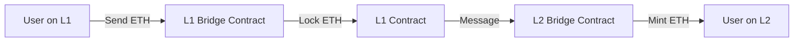
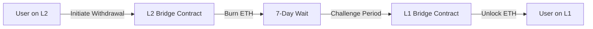

The TeQoin bridge allows you to move ETH between Ethereum (L1) and TeQoin L2 safely and efficiently.

<Note>
**Key Concepts:**
- **Deposit (L1 → L2):** Fast (~15 minutes)
- **Withdraw (L2 → L1):** Secure (7 days)
- **1:1 Backing:** 1 ETH on L1 = 1 ETH on L2
- **Security:** Optimistic rollup with fraud proofs
</Note>

---

## 🌉 What is the Bridge?

The TeQoin bridge is a set of smart contracts that enables **trustless transfer** of assets between Ethereum L1 and TeQoin L2.

### How It Works

<Tabs>
  <Tab title="Deposit (L1 → L2)">

    
    **Process:**
    1. You send ETH to the L1 bridge contract
    2. Your ETH is **locked** on Ethereum
    3. Bridge sends a message to L2
    4. Equivalent ETH is **minted** on TeQoin L2
    5. You receive ETH on L2 (1:1 ratio)
    
    **Time:** ~15 minutes  
    **Cost:** Ethereum L1 gas fee ($10-50)
  </Tab>
  
  <Tab title="Withdraw (L2 → L1)">

    
    **Process:**
    1. You initiate withdrawal on L2
    2. Your ETH is **burned** on TeQoin L2
    3. **7-day challenge period** begins
    4. After 7 days, you finalize on L1
    5. ETH is **unlocked** from L1 bridge
    6. You receive ETH on Ethereum
    
    **Time:** 7 days + 15 minutes  
    **Cost:** L2 fee (~$0.001) + L1 finalization fee ($10-30)
  </Tab>
</Tabs>

---

## 🔑 Key Features

<CardGroup cols={2}>
  <Card title="Trustless" icon="handshake-slash">
    No intermediaries - secured by smart contracts and fraud proofs
  </Card>
  
  <Card title="1:1 Backing" icon="scale-balanced">
    Every ETH on L2 is backed by locked ETH on L1
  </Card>
  
  <Card title="Secure" icon="shield-check">
    Optimistic rollup with 7-day challenge period
  </Card>
  
  <Card title="Transparent" icon="eye">
    All transactions visible on-chain
  </Card>
</CardGroup>

---

## 📊 Comparison: Deposit vs Withdraw

| Feature | Deposit (L1 → L2) | Withdraw (L2 → L1) |
|---------|-------------------|-------------------|
| **Time** | ~15 minutes | 7 days + 15 min |
| **L1 Gas** | $10-50 (deposit) | $10-30 (finalize) |
| **L2 Gas** | ~$0 (covered) | ~$0.001 (initiate) |
| **Steps** | 1 transaction | 2 transactions |
| **Complexity** | Simple | Moderate |
| **Cancellable** | No | No |

---

## 🔐 Security Model

### Optimistic Rollup Security

TeQoin uses **optimistic rollup** technology, which means:

<Steps>
  <Step title="Optimistic Assumption">
    Transactions are assumed to be valid by default
  </Step>
  
  <Step title="Challenge Period">
    For withdrawals, there's a 7-day window where anyone can challenge invalid transactions
  </Step>
  
  <Step title="Fraud Proofs">
    If someone submits invalid data, fraud proofs can be submitted to prove it's wrong
  </Step>
  
  <Step title="Automatic Reversion">
    Invalid transactions are reverted, and the challenger is rewarded
  </Step>
</Steps>

<Note>
**Why 7 Days?**

The 7-day challenge period is a security feature, not a limitation. It ensures:
- ✅ Enough time for fraud detection
- ✅ Decentralized security (anyone can verify)
- ✅ No trust in the sequencer required
- ✅ Your funds are always safe
</Note>

---

## 💰 Bridge Contracts

### L1 Bridge Contract (Ethereum)
```
Address: 0x919aa27d5278BC98bf40BA5A79be468B91f061dA
Network: Ethereum Mainnet
Chain ID: 1
```

**Functions:**
- `depositETH()` - Deposit ETH to L2
- `finalizeWithdrawal()` - Complete withdrawal from L2

### L2 Bridge Contract (TeQoin)
```
Address: 0x4200000000000000000000000000000000000010
Network: TeQoin L2
Chain ID: 420377
```

**Functions:**
- `initiateWithdrawal()` - Start withdrawal to L1
- `withdraw()` - Alias for initiateWithdrawal

[View Contract ABIs →](/resources/contract-abis)

---

## 📈 Bridge Statistics

<CardGroup cols={3}>
  <Card title="Total Value Locked" icon="vault">
    **$5.2M**
    
    ETH locked in bridge
  </Card>
  
  <Card title="Total Bridges" icon="bridge">
    **25,000+**
    
    Successful transfers
  </Card>
  
  <Card title="Success Rate" icon="check">
    **99.99%**
    
    Bridge reliability
  </Card>
  
  <Card title="Average Deposit Time" icon="clock">
    **12 minutes**
    
    L1 → L2 transfer
  </Card>
  
  <Card title="Total Users" icon="users">
    **8,500+**
    
    Unique addresses
  </Card>
  
  <Card title="Uptime" icon="signal">
    **99.9%**
    
    Bridge availability
  </Card>
</CardGroup>

---

## 🎯 Use Cases

### When to Use Deposits (L1 → L2)

<CardGroup cols={2}>
  <Card title="Start Using TeQoin" icon="rocket">
    Move ETH to L2 to start making low-fee transactions
  </Card>
  
  <Card title="Deploy Contracts" icon="code">
    Bridge ETH to deploy smart contracts on L2
  </Card>
  
  <Card title="Use dApps" icon="mobile">
    Access TeQoin L2 DeFi, NFTs, and games
  </Card>
  
  <Card title="Save on Fees" icon="coins">
    Move funds to L2 for low-cost operations
  </Card>
</CardGroup>

### When to Use Withdrawals (L2 → L1)

<CardGroup cols={2}>
  <Card title="Return to L1" icon="arrow-left">
    Move funds back to Ethereum mainnet
  </Card>
  
  <Card title="Use L1 DeFi" icon="chart-line">
    Access Ethereum L1 DeFi protocols
  </Card>
  
  <Card title="Cash Out" icon="money-bill">
    Withdraw to L1 for exchange deposits
  </Card>
  
  <Card title="Long-term Storage" icon="vault">
    Move to L1 cold storage
  </Card>
</CardGroup>

---

## ⚠️ Important Considerations

<AccordionGroup>
  <Accordion title="Withdrawal Waiting Period">
    **Withdrawals take 7 days** due to the challenge period.
    
    **Plan accordingly:**
    - Need L1 funds urgently? Keep some on L1
    - Start withdrawal 7 days before you need the funds
    - Use third-party bridges for faster withdrawals (less secure)
    
    **Why can't it be instant?**
    
    The 7-day period is a security feature. It allows time for:
    - Fraud detection
    - Challenge submission
    - Proof verification
    
    This is what makes TeQoin secure without trusting centralized parties.
  </Accordion>
  
  <Accordion title="Gas Costs">
    **L1 Gas Fees:**
    - Deposits: $10-50 (depends on Ethereum gas price)
    - Finalization: $10-30 (depends on Ethereum gas price)
    
    **L2 Gas Fees:**
    - Initiate withdrawal: ~$0.001 (very low)
    - Covered by bridge for deposits
    
    **Tips to save on gas:**
    - Bridge during low gas periods (weekends, late night US time)
    - Check gas prices: https://etherscan.io/gastracker
    - Bridge larger amounts less frequently
  </Accordion>
  
  <Accordion title="Minimum and Maximum Amounts">
    **Recommended Minimums:**
    - Deposit: 0.01 ETH (to cover L1 gas)
    - Withdraw: 0.05 ETH (to cover both L2 and L1 gas)
    
    **Maximum:**
    - No hard limit
    - Practical limit: Bridge capacity (~1000 ETH per transaction)
    
    **For large amounts:**
    - Consider splitting into multiple transactions
    - Contact support for assistance with very large transfers
  </Accordion>
  
  <Accordion title="Bridge Reliability">
    **The bridge is highly reliable:**
    - 99.9% uptime
    - Automated monitoring
    - Redundant infrastructure
    
    **In rare cases of downtime:**
    - Your funds are always safe in the smart contracts
    - Deposits/withdrawals will process when bridge resumes
    - Check status at https://status.teqoin.io
  </Accordion>
  
  <Accordion title="No Tokens Yet">
    **Current Support:**
    - ✅ ETH (native currency)
    
    **Coming Soon:**
    - ERC-20 token bridging
    - ERC-721 NFT bridging
    
    For now, only ETH can be bridged between L1 and L2.
  </Accordion>
</AccordionGroup>

---

## 🛠️ Bridge Interface

### Official Bridge

**URL:** https://bridge.teqoin.io

**Features:**
- User-friendly interface
- Transaction tracking
- Real-time status updates
- Historical bridge transactions
- Gas price estimates

### Alternative Methods

<Tabs>
  <Tab title="Programmatic">
    Interact with bridge contracts directly via code.
    
    [View developer guide →](/developers/integration-guide)
  </Tab>
  
  <Tab title="Block Explorer">
    Call bridge functions directly on https://explorer.teqoin.io
    
    (Advanced users only)
  </Tab>
</Tabs>

---

## 📚 Learn More

<CardGroup cols={2}>
  <Card title="Deposit Guide" icon="arrow-down" href="/bridge/deposit-l1-to-l2">
    Step-by-step guide to deposit ETH from L1 to L2
  </Card>
  
  <Card title="Withdrawal Guide" icon="arrow-up" href="/bridge/withdraw-l2-to-l1">
    Complete guide to withdraw ETH from L2 to L1
  </Card>
  
  <Card title="Challenge Period" icon="clock" href="/bridge/challenge-period">
    Understanding the 7-day security period
  </Card>
  
  <Card title="Bridge FAQ" icon="circle-question" href="/bridge/faq">
    Common questions and answers
  </Card>
</CardGroup>

---

## 🔐 Security Tips

<Warning>
**Only Use Official Bridge**

- ✅ Use: https://bridge.teqoin.io
- ❌ Avoid: Third-party bridges (less secure)
- ❌ Never: Send ETH directly to contract addresses

Always verify the URL before connecting your wallet!
</Warning>

<Tip>
**Verify Transactions**

After bridging:
1. Check transaction on block explorer
2. Verify contract addresses match official ones
3. Confirm amounts are correct
4. Save transaction hashes for records
</Tip>

---

## 💬 Get Help

<CardGroup cols={3}>
  <Card title="Discord Support" icon="discord" href="https://discord.gg/teqoin">
    Ask questions in our community
  </Card>
  
  <Card title="Bridge FAQ" icon="circle-question" href="/bridge/faq">
    Common issues and solutions
  </Card>
  
  <Card title="Status Page" icon="signal" href="https://status.teqoin.io">
    Check bridge operational status
  </Card>
</CardGroup>

---

**Ready to bridge?** Start with [Deposit (L1 → L2)](/bridge/deposit-l1-to-l2) →