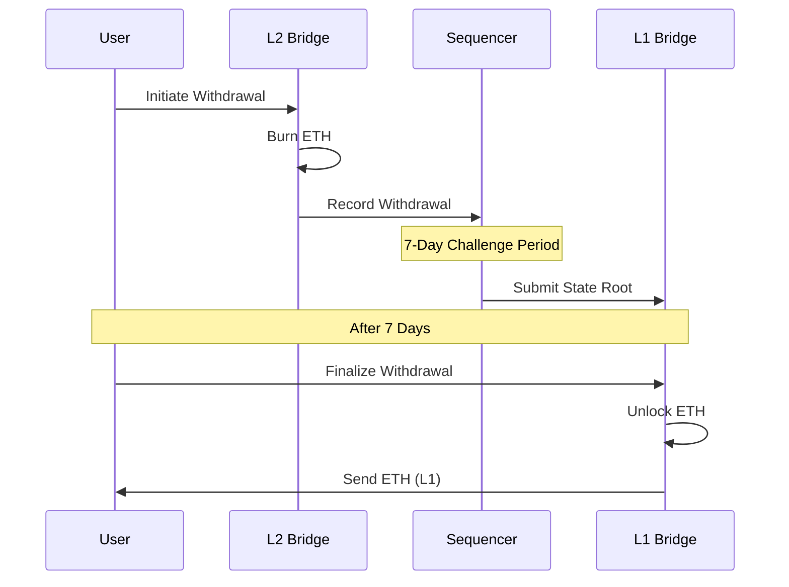

Transfer ETH from TeQoin L2 back to Ethereum mainnet securely.

<Warning>
**Important: Withdrawals take 7 days**

Due to the optimistic rollup security model, withdrawals require a 7-day challenge period. This is a security feature, not a limitation.

**Timeline:**
- Initiate withdrawal: Instant
- Challenge period: 7 days
- Finalize withdrawal: ~15 minutes
- **Total: 7 days + 15 minutes**
</Warning>

<Note>
**Quick Facts:**
- ⏱️ **Time:** 7 days + 15 minutes
- 💰 **L2 Gas Fee:** ~$0.001 (initiate)
- 💰 **L1 Gas Fee:** $10-30 (finalize)
- 🔄 **Ratio:** 1 ETH on L2 = 1 ETH on L1
- ✅ **Cancellable:** No (irreversible once initiated)
</Note>

---

## 📋 Prerequisites

Before you start, make sure you have:

<Steps>
  <Step title="ETH on TeQoin L2">
    You need ETH on TeQoin L2 to withdraw.
    
    **Minimum recommended:** 0.05 ETH (to cover finalization gas)
  </Step>
  
  <Step title="Wallet Connected to L2">
    - MetaMask or TeQoin Telegram Wallet
    - Connected to **TeQoin L2** network
    - Sufficient ETH for L2 gas (~$0.001)
  </Step>
  
  <Step title="ETH for L1 Finalization">
    You'll need ETH on L1 to finalize withdrawal after 7 days
    
    **Amount needed:** ~0.01 ETH for L1 gas
  </Step>
  
  <Step title="Patience">
    Be prepared to wait 7 days before accessing funds on L1
    
    ⏰ **Set a reminder** for 7 days from now!
  </Step>
</Steps>

---

## 🌉 How Withdrawals Work

### The Process


**Step-by-step:**

1. **You initiate withdrawal** on L2
2. **ETH is burned** on TeQoin L2
3. **Withdrawal is recorded** in the bridge
4. **7-day challenge period** begins
5. **After 7 days**, withdrawal is ready
6. **You finalize** on Ethereum L1
7. **ETH is unlocked** and sent to you

**Why 7 days?** [Learn about the challenge period →](/bridge/challenge-period)

---

## 🎯 Step-by-Step Guide

### Phase 1: Initiate Withdrawal (Day 0)

<Steps>
  <Step title="Visit the Bridge">
    Go to the official TeQoin bridge:
    
    **🔗 https://bridge.teqoin.io**
    
    <Warning>
    **Security Alert:** Always verify you're on the official bridge URL.
    </Warning>
  </Step>
  
  <Step title="Connect Wallet to L2">
    1. Click **"Connect Wallet"**
    2. Select your wallet
    3. Approve the connection
    
    **Important:** Make sure you're connected to **TeQoin L2** (not Ethereum Mainnet)
    
    <Tip>
    Check your wallet network indicator. It should show "TeQoin L2" or chain ID "420377".
    </Tip>
  </Step>
  
  <Step title="Select Withdraw Tab">
    Click the **"Withdraw"** or **"L2 → L1"** tab
    
    The interface should show:
    - From: TeQoin L2
    - To: Ethereum Mainnet
  </Step>
  
  <Step title="Enter Amount">
    Enter the amount of ETH you want to withdraw
    
    **Examples:**
    - `0.1` - Withdraw 0.1 ETH
    - `1.5` - Withdraw 1.5 ETH
    - Click **"Max"** to withdraw all ETH
    
    <Note>
    **Keep some ETH on L2** for future transactions and gas fees!
    </Note>
  </Step>
  
  <Step title="Review Transaction Details">
    The bridge will show:
    
    | Detail | Information |
    |--------|-------------|
    | **Amount to Withdraw** | ETH you're withdrawing |
    | **You'll Receive** | Same amount on L1 (minus gas) |
    | **L2 Gas Fee** | ~$0.001 (very low) |
    | **L1 Finalization Fee** | ~$10-30 (estimated) |
    | **Waiting Period** | 7 days |
    | **Ready to Finalize** | Date/time (7 days from now) |
    
    <Warning>
    **Important Notice:**
    
    ⏰ You must wait 7 days before finalizing
    
    After initiating, you CANNOT cancel the withdrawal!
    </Warning>
  </Step>
  
  <Step title="Initiate Withdrawal">
    1. Click **"Withdraw"** or **"Initiate Withdrawal"**
    2. MetaMask popup appears
    3. Review transaction (connected to L2):
       - **To:** L2 Bridge Contract
       - **Amount:** Your withdrawal amount
       - **Gas Fee:** Very low (~$0.001)
    4. Click **"Confirm"** in MetaMask
    
    The transaction confirms in ~5 seconds on L2.
  </Step>
  
  <Step title="Save Transaction Info">
    **IMPORTANT:** Save this information:
```
    ✅ L2 Transaction Hash: 0x...
    ✅ Withdrawal Amount: X.XX ETH
    ✅ Initiated Date: [Today's Date]
    ✅ Ready to Finalize: [Date 7 days from now]
```
    
    <Tip>
    **Set a calendar reminder** for 7 days from now to finalize your withdrawal!
    </Tip>
  </Step>
  
  <Step title="Wait 7 Days">
    Your withdrawal is now in the challenge period:
    
    - ✅ L2 transaction confirmed
    - 🔥 Your ETH is burned on L2
    - ⏳ 7-day challenge period active
    - 💤 Nothing more to do - just wait
    
    The bridge interface shows:
    - **Status:** Challenge Period
    - **Time Remaining:** X days, Y hours
    - **Ready to Finalize:** [Date/Time]
    
    ✅ **Withdrawal initiated!** Come back in 7 days.
  </Step>
</Steps>

---

### Phase 2: Finalize Withdrawal (Day 7)

After 7 days have passed:

<Steps>
  <Step title="Return to Bridge (After 7 Days)">
    Go back to https://bridge.teqoin.io
    
    **Check the date:** Make sure 7 full days have passed
  </Step>
  
  <Step title="Connect Wallet to L1">
    1. Connect your wallet
    2. **Switch to Ethereum Mainnet** (not L2)
    3. Make sure you have ~0.01 ETH for L1 gas
    
    <Warning>
    You MUST be on Ethereum L1 to finalize!
    </Warning>
  </Step>
  
  <Step title="View Pending Withdrawals">
    The bridge shows your withdrawal:
    
    - **Status:** ✅ Ready to Finalize
    - **Amount:** Your withdrawal amount
    - **Action:** "Finalize" button enabled
    
    If you see "Still in challenge period", wait longer - the full 7 days must pass.
  </Step>
  
  <Step title="Finalize Withdrawal">
    1. Click **"Finalize Withdrawal"**
    2. MetaMask popup appears (connected to L1)
    3. Review transaction:
       - **To:** L1 Bridge Contract
       - **Amount:** 0 ETH (you're claiming, not sending)
       - **Gas Fee:** $10-30 (Ethereum L1 gas)
    4. Click **"Confirm"** in MetaMask
  </Step>
  
  <Step title="Wait for L1 Confirmation">
    Your finalization transaction processes on Ethereum:
    
    - **Time:** 2-5 minutes
    - **Confirmations:** Wait for ~12 confirmations
    
    The bridge shows:
    - ⏳ Finalizing on L1
    - 🔄 Processing transaction
  </Step>
  
  <Step title="Withdrawal Complete">
    ✅ **ETH received on Ethereum L1!**
    
    Verify:
    1. Check your L1 wallet balance (should increase)
    2. View transaction on Etherscan
    3. Confirm amount matches your withdrawal
    
    🎉 **Congratulations!** Your withdrawal is complete.
  </Step>
</Steps>

---

## 💰 Cost Breakdown

### Example: Withdraw 1 ETH

**Phase 1: Initiate (Day 0)**
```
Amount to Withdraw:          1.0 ETH
─────────────────────────────────────
L2 Gas Fee:                 ~0.0001 ETH ($0.20)
─────────────────────────────────────
Total L2 Cost:              ~$0.20
```

**Phase 2: Finalize (Day 7)**
```
L1 Gas Fee:                 ~0.005 ETH ($10-20)
─────────────────────────────────────
Total L1 Cost:              ~$10-20
```

**Total Withdrawal Cost:**
```
L2 Fee:                      $0.20
L1 Fee:                      $15.00 (average)
─────────────────────────────────────
Total Cost:                  $15.20

Amount Sent from L2:         1.0 ETH
You Receive on L1:          ~0.9925 ETH (after gas)
```

### When to Finalize (Gas Optimization)

<Tabs>
  <Tab title="Best Times">
    Finalize during low Ethereum gas periods:
    
    - 🌙 **Late night** (2-6 AM US Eastern)
    - 📅 **Weekends** (Saturday-Sunday)
    - 🏖️ **Holidays**
    
    **Potential savings:** 50-70% on L1 gas
    
    Example:
    - High gas (100 gwei): $30 finalization
    - Low gas (20 gwei): $10 finalization
    - **Savings: $20**
  </Tab>
  
  <Tab title="Gas Monitoring">
    **Check gas before finalizing:**
    
    1. Visit https://etherscan.io/gastracker
    2. Look at current gas price:
       - ✅ Low (< 30 gwei): Good time
       - 🟡 Medium (30-70 gwei): Acceptable
       - 🔴 High (> 70 gwei): Wait if possible
    
    **You can finalize anytime after 7 days**
    
    No rush - save on gas by waiting for low prices!
  </Tab>
  
  <Tab title="Set Alerts">
    **Get notified when gas is cheap:**
    
    1. Use https://etherscan.io/gastracker
    2. Set up email/SMS alerts
    3. Get notified when gas drops below your threshold
    4. Finalize during the low period
    
    This can save you $10-20 per withdrawal!
  </Tab>
</Tabs>

---

## 📊 Tracking Your Withdrawal

### On the Bridge Interface

The bridge tracks withdrawal status:

<Tabs>
  <Tab title="Day 0-7 (Challenge Period)">
```
    Status: ⏳ Challenge Period Active
    
    Progress Bar: [████░░░░░░] 3/7 days
    
    Time Remaining: 4 days, 12 hours
    Ready to Finalize: Feb 29, 2026 10:30 AM
    
    Details:
    ✅ L2 Transaction: Confirmed
    ✅ ETH Burned: Yes
    ⏳ Challenge Period: In Progress
    ❌ Ready to Finalize: Not Yet
    
    Actions:
    [View on L2 Explorer]
    [Track Progress]
```
  </Tab>
  
  <Tab title="After 7 Days (Ready)">
```
    Status: ✅ Ready to Finalize
    
    Progress Bar: [██████████] 7/7 days
    
    Ready Since: Feb 29, 2026 10:30 AM
    
    Details:
    ✅ L2 Transaction: Confirmed
    ✅ ETH Burned: Yes
    ✅ Challenge Period: Complete
    ✅ Ready to Finalize: Yes
    
    Actions:
    [Finalize Withdrawal] ← Click to complete
    [View on L1 Explorer]
```
  </Tab>
  
  <Tab title="After Finalization">
```
    Status: ✅ Complete
    
    L2 Transaction: 0xabc...
    L1 Finalization: 0xdef...
    
    Amount: 1.0 ETH
    Received: 0.9925 ETH (after gas)
    
    Timeline:
    ✅ Initiated: Feb 22, 2026 10:30 AM
    ✅ Finalized: Feb 29, 2026 11:45 AM
    
    Total Time: 7 days, 1 hour, 15 minutes
```
  </Tab>
</Tabs>

### On Block Explorers

<Tabs>
  <Tab title="TeQoin (L2) - Initiation">
    **View L2 transaction:**
    
    1. Go to https://explorer.teqoin.io
    2. Paste your L2 transaction hash
    3. Verify:
       - ✅ Status: Success
       - ✅ To: L2 Bridge Contract
       - ✅ Function: initiateWithdrawal
       - ✅ Amount: Your withdrawal amount
  </Tab>
  
  <Tab title="Ethereum (L1) - Finalization">
    **View L1 transaction:**
    
    1. Go to https://etherscan.io
    2. Paste your L1 transaction hash
    3. Verify:
       - ✅ Status: Success
       - ✅ To: L1 Bridge Contract
       - ✅ Function: finalizeWithdrawal
       - ✅ ETH received in your wallet
  </Tab>
</Tabs>

---

## 🔧 Troubleshooting

<AccordionGroup>
  <Accordion title="Can I cancel my withdrawal?">
    **No, withdrawals cannot be cancelled** once initiated.
    
    Once you initiate:
    - Your L2 ETH is immediately burned
    - Withdrawal enters 7-day challenge period
    - You must wait and finalize on L1
    
    **Options:**
    - Complete the withdrawal (finalize after 7 days)
    - Once on L1, you can deposit back to L2 if needed
  </Accordion>
  
  <Accordion title="Finalize button is disabled / grayed out">
    The 7-day challenge period hasn't completed yet.
    
    **Solution:**
    1. Check "Time Remaining" on bridge interface
    2. Wait until countdown reaches 0
    3. Make sure 7 FULL days have passed
    4. Refresh the page
    
    The button enables exactly 7 days after initiation.
  </Accordion>
  
  <Accordion title="Forgot to finalize / Missed the deadline">
    **There is no deadline!**
    
    You can finalize your withdrawal:
    - 7 days after initiation ✅
    - 8 days later ✅
    - 30 days later ✅
    - 1 year later ✅
    
    Your funds are safe in the L1 bridge contract. Finalize whenever you're ready (preferably during low gas periods).
  </Accordion>
  
  <Accordion title="Wrong network when trying to finalize">
    You're connected to L2 instead of L1.
    
    **Solution:**
    1. Open your wallet (MetaMask)
    2. Click network dropdown
    3. Select **"Ethereum Mainnet"** (NOT TeQoin L2)
    4. Return to bridge interface
    5. Finalize button should now work
  </Accordion>
  
  <Accordion title="Finalization transaction failed">
    **Common reasons:**
    - Insufficient ETH on L1 for gas
    - Gas limit too low
    - Network congestion
    
    **Solution:**
    1. Check error message on Etherscan
    2. Make sure you have ~0.01 ETH on L1
    3. Try again with higher gas limit
    4. Your withdrawal is still safe - just retry
  </Accordion>
  
  <Accordion title="Don't see my withdrawal on bridge interface">
    **Solutions:**
    
    1. **Wrong wallet:**
       - Make sure you're using the same wallet that initiated
       - Check wallet address matches
    
    2. **Wrong network:**
       - Bridge shows L2 → L1 withdrawals
       - Make sure you're looking at the right direction
    
    3. **Different browser/device:**
       - Withdrawal data is stored in browser cache
       - Use same browser or manually enter TX hash
    
    4. **Clear cache:**
       - Refresh the page
       - Clear browser cache
       - Reconnect wallet
  </Accordion>
  
  <Accordion title="ETH not received after finalization">
    Finalized but ETH not in wallet.
    
    **Solution:**
    1. Check finalization transaction on Etherscan
    2. Verify status shows "Success"
    3. Make sure you're on Ethereum L1 network
    4. Refresh wallet (disconnect/reconnect)
    5. Check the correct wallet address
    
    If finalization succeeded, ETH was sent to your address. Check you're viewing the right network and wallet.
  </Accordion>
</AccordionGroup>

---

## ⏰ Important Timeline Reminders

<Warning>
**Set Multiple Reminders**

Don't forget to finalize your withdrawal!

**Recommended reminders:**
- 📅 6 days after initiation: "Withdrawal ready tomorrow"
- 📅 7 days after initiation: "Withdrawal ready - finalize now"
- 📅 7 days + 1 week: "Finalize withdrawal (no rush, but don't forget)"

**Add to calendar:**
- Calendar app on phone
- Google Calendar with email reminder
- Outlook with notification
</Warning>

<Tip>
**Gas Price Alerts**

Since you can finalize anytime after 7 days:

1. Wait for low gas periods
2. Set up gas price alerts on Etherscan
3. Finalize when notified about low gas
4. Save $10-20 on transaction costs!
</Tip>

---

## ✅ Post-Withdrawal Checklist

<Steps>
  <Step title="Verify L1 Balance">
```bash
    1. Switch to Ethereum Mainnet in wallet
    2. Check balance increased by withdrawal amount
    3. Account for gas fees
```
  </Step>
  
  <Step title="Save Transaction Records">
```bash
    # Keep these for your records:
    - L2 initiation TX hash
    - L1 finalization TX hash
    - Withdrawal amount
    - Initiation date
    - Finalization date
    - Total time taken
```
  </Step>
  
  <Step title="Update Records">
    If you track your portfolio:
    - Remove ETH from L2 balance
    - Add ETH to L1 balance
    - Note withdrawal fees for tax purposes
  </Step>
</Steps>

---

## 💡 Best Practices

<Tip>
**Plan Withdrawals 7 Days in Advance**

If you know you'll need ETH on L1:
- Start withdrawal 7 days early
- Don't wait until you urgently need funds
- Withdrawals cannot be expedited
</Tip>

<Tip>
**Keep Some ETH on Both Networks**

Maintain balances on both L1 and L2:
- L1: For mainnet operations and gas
- L2: For low-fee transactions
- Never withdraw everything at once
</Tip>

<Tip>
**Batch Withdrawals**

Instead of many small withdrawals:
- Accumulate ETH on L2
- Withdraw larger amounts less frequently
- Save on L1 finalization fees
</Tip>

<Tip>
**Finalize During Low Gas**

You can wait after the 7-day period:
- Monitor Ethereum gas prices
- Finalize during weekends or late night
- Save 50-70% on finalization costs
</Tip>

---

## 🎯 Next Steps

<CardGroup cols={2}>
  <Card title="Understand Challenge Period" icon="clock" href="/bridge/challenge-period">
    Learn why withdrawals take 7 days
  </Card>
  
  <Card title="Bridge FAQ" icon="circle-question" href="/bridge/faq">
    Common questions about bridging
  </Card>
  
  <Card title="Deposit to L2" icon="arrow-down" href="/bridge/deposit-l1-to-l2">
    Move ETH from L1 back to L2
  </Card>
  
  <Card title="Bridge Overview" icon="bridge" href="/bridge/overview">
    Learn more about the bridge
  </Card>
</CardGroup>

---

**Withdrawal complete?** Or learn more about the [7-day challenge period](/bridge/challenge-period) →