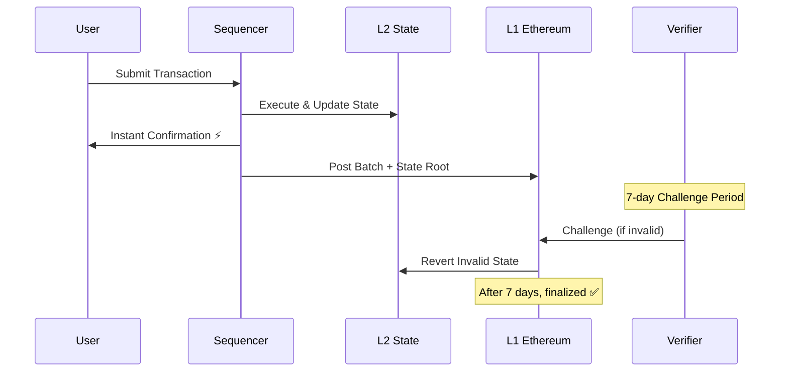

# Key Features

TeQoin combines cutting-edge blockchain technology with user-friendly design to deliver a superior Layer-2 experience.

## 🎯 Core Features

<CardGroup cols={2}>
  <Card title="Low Transaction Fees" icon="coins" href="#low-fees">
    Pay $0 in gas fees for all transactions
  </Card>
  <Card title="5-Second Blocks" icon="clock" href="#fast-blocks">
    Lightning-fast transaction confirmation
  </Card>
  <Card title="EVM Compatible" icon="code" href="#evm-compatible">
    100% compatible with Ethereum tools
  </Card>
  <Card title="Ethereum Security" icon="shield" href="#security">
    Inherits Ethereum's security model
  </Card>
  <Card title="Optimistic -> ZK" icon="layer-group" href="#road">
    Currently powered by **Optimistic Rollup** technology, transitioning to 
  **Zero-Knowledge (ZK)**
  </Card>
  <Card title="Seamless Bridge" icon="bridge" href="#bridge">
    Easy L1 ↔ L2 asset transfers
  </Card>
</CardGroup>

---

## Low Zero Transaction Fees

The most revolutionary feature: **users never pay gas fees**.

<Tabs>
  <Tab title="For Users">
    ### Truly Free Transactions
    
    - **low gas fees** for every transaction
    - **No hidden costs** or surprise charges
    - **Unlimited transactions** without worrying about costs
    - **Microtransactions enabled** - send Microtransactions if you want
    
    <Check>Send ETH</Check>
    <Check>Trade tokens</Check>
    <Check>Mint NFTs</Check>
    <Check>Interact with smart contracts</Check>
    <Check>All for low fee</Check>
  </Tab>
  
  <Tab title="Technical Details">
    ### How It Works
    
    1. **Batch Processing**: Transactions are batched together
    2. **L1 Posting**: Sequencer posts batches to Ethereum L1
    3. **Cost Amortization**: L1 costs spread across many users
    4. **Sequencer Subsidy**: TeQoin covers remaining costs

  </Tab>
  
  <Tab title="Use Cases">
    ### Enabled Use Cases
    
    **Gaming:**
    - Free in-game item transfers
    - low-cost NFT trades between players
    - Unlimited gameplay actions
    
    **Social:**
    - Micro-tips to content creators
    - Free profile updates
    - social interactions
    
    **DeFi:**
    - Profitable trading of small amounts
    - better strategies
    - Dollar-cost averaging
  </Tab>
</Tabs>

---

## ⚡ 5-Second Blocks 

Near-instant transaction confirmation for responsive applications.

### User Experience Impact

<CodeGroup>
```javascript Before (L1)
// User clicks "Send"
await tx.wait(); // ⏳ 12-15 seconds...
```
```javascript After (L2)
// User clicks "Send"
await tx.wait(); // ⚡ 5 seconds!
```
</CodeGroup>

<Note>
**Faster confirmation** means users don't have to wait and wonder if their transaction went through. This dramatically improves UX and reduces bounce rates.
</Note>

### Perfect For

<CardGroup cols={3}>
  <Card title="Real-Time Games" icon="gamepad">
    Instant player actions
  </Card>
  <Card title="Live Trading" icon="chart-line">
    Execute trades quickly
  </Card>
  <Card title="Interactive Apps" icon="mobile">
    Responsive user experience
  </Card>
</CardGroup>

---

## 🔧 Full EVM Compatibility 

**100% compatible** with Ethereum - zero learning curve for developers.

### What Works

<AccordionGroup>
  <Accordion title="Smart Contract Languages">
    - ✅ **Solidity** - Full support 
    - ✅ **Vyper** - Full support
    - ✅ **Yul** - Full support
    
    Deploy existing contracts **without any modifications**.
  </Accordion>
  
  <Accordion title="Development Tools">
    - ✅ **Hardhat** - Complete support
    - ✅ **Foundry** - Complete support
    - ✅ **Truffle** - Complete support
    - ✅ **Remix** - Works out of the box
    - ✅ **Brownie** - Full compatibility
    
    Use your existing development workflow.
  </Accordion>
  
  <Accordion title="Frontend Libraries">
    - ✅ **Web3.js** - Full support
    - ✅ **Ethers.js** - Full support
    - ✅ **Viem** - Full support
    - ✅ **Wagmi** - Full support
    
    Same code, same APIs, same experience.
  </Accordion>
  
  <Accordion title="Wallet Support">
    - ✅ **TeQoinWallet** - Full support 
    - ✅ **MetaMask** - Full support
    - ✅ **WalletConnect** - Full support
    - ✅ **Coinbase Wallet** - Full support
    - ✅ **Rainbow** - Full support
    - ✅ **Rabby** - Full support
    
    Users can use their favorite wallets.
  </Accordion>
  
  <Accordion title="EVM Opcodes">
    - ✅ All standard opcodes supported
    - ✅ All precompiles available
    - ✅ Same gas costs as Ethereum
    - ✅ Same execution semantics
    
    Bytecode-level compatibility.
  </Accordion>
</AccordionGroup>

### Migration Process

<Steps>
  <Step title="Zero Code Changes">
    Your existing Solidity contracts work as-is on TeQoin.
  </Step>
  
  <Step title="Update Network Config">
    Change RPC URL
  </Step>
  
  <Step title="Deploy">
    Run your normal deployment command. Done!
  </Step>
</Steps>
```bash
# That's literally it
npx hardhat run scripts/deploy.js --network teqoin
```

---

## 🔒 Ethereum-Grade Security 

Security is **not compromised** for speed or low costs.

### Security Model

<Tabs>
  <Tab title="Data Availability">
    ### All Data on Ethereum
    
    - **Transaction data** posted to Ethereum L1
    - **State roots** committed to L1
    - **Anyone can reconstruct** the L2 state from L1 data
    - **Censorship resistant** - can't hide invalid transactions
    
    <Check>Full transparency</Check>
    <Check>Public verifiability</Check>
    <Check>Data always available</Check>
  </Tab>
  
  <Tab title="Fraud Proofs">
    ### Enforced Correctness
    
    - **7-day challenge period** for withdrawals
    - **Anyone can challenge** invalid state transitions
    - **Fraud proofs** submitted to L1 contracts
    - **Invalid state reverted** automatically
    
    <Warning>
    If the sequencer cheats, fraud proofs guarantee your funds are safe.
    </Warning>
  </Tab>
  
  <Tab title="Trust Model">
    ### Trustless Operation
    
    **You DON'T need to trust:**
    - ❌ TeQoin team
    - ❌ Sequencer operator
    - ❌ Any centralized party
    
    **You DO trust:**
    - ✅ Ethereum L1 (same as any L1 user)
    - ✅ Cryptographic fraud proofs
    - ✅ Open-source smart contracts
  </Tab>
  
  <Tab title="Censorship Resistance">
    ### Forced Inclusion
    
    If the sequencer censors your transaction:
    
    1. **Submit directly to L1** via the bridge contract
    2. **Sequencer must include** your transaction
    3. **Or sequencer gets slashed** for invalid state
    
    The network remains accessible even if the sequencer is malicious.
  </Tab>
</Tabs>

### Security Guarantees

<CardGroup cols={2}>
  <Card title="No Fund Loss" icon="vault">
    Your funds are secured by Ethereum L1 smart contracts
  </Card>
  <Card title="No Censorship" icon="ban">
    No Transaction censor.
  </Card>
  <Card title="No Invalid State" icon="xmark">
    Fraud proofs prevent invalid state transitions
  </Card>
  <Card title="No Trust Required" icon="handshake-slash">
    Security is cryptographically enforced, not trust-based
  </Card>
</CardGroup>

---

## 📦 Optimistic Rollup

Advanced Layer-2 scaling using optimistic assumptions.

### How It Works


### Key Concepts

<AccordionGroup>
  <Accordion title="Optimistic Assumption">
    Allows better execution without waiting for proof verification.
    
    can challenges a transaction does it need to be proven valid.
  </Accordion>
  
  <Accordion title="Batch Posting">
    Multiple transactions are **batched together** and posted to Ethereum L1 as a single transaction.
    
    This dramatically reduces costs compared to posting each transaction individually.
  </Accordion>
  
  <Accordion title="State Roots">
    After each batch, the sequencer posts a **state root** (cryptographic hash of the current state) to L1.
    
    This allows anyone to verify the state is correct.
  </Accordion>
  
  <Accordion title="Challenge Period">
    Withdrawals have a **7-day waiting period** during which anyone can challenge invalid transactions.
    
    This is the security tradeoff for  L2 confirmation.
  </Accordion>
</AccordionGroup>

### Benefits

| Benefit | Description |
|---------|-------------|
| **Execution** | Optimistic assumption allows better transaction processing |
| **Low Cost** | Batching reduces L1 costs by ~100x |
| **Security** | Fraud proofs ensure correctness without trusting sequencer |
| **Scalability** | Can process 100+ TPS vs. 15-30 on L1 |

---

## 🌉 Seamless Bridge

Move assets between Ethereum L1 and TeQoin L2 easily.

### Bridge Features

<CardGroup cols={2}>
  <Card title="Instant Deposits" icon="arrow-down">
    L1 → L2 transfers complete in ~15 minutes
  </Card>
  <Card title="Secure Withdrawals" icon="arrow-up">
    L2 → L1 transfers with 7-day fraud proof protection
  </Card>
  <Card title="ETH Support" icon="ethereum">
    Native ETH bridging (1:1 backing)
  </Card>
  <Card title="ERC20 Support" icon="coins">
    Bridge ERC20 tokens (coming soon)
  </Card>
</CardGroup>

### How Bridging Works

<Tabs>
  <Tab title="Deposit (L1 → L2)">
    <Steps>
      <Step title="Lock on L1">
        Send ETH to the L1 bridge contract. Your ETH is locked.
      </Step>
      
      <Step title="Mint on L2">
        TeQoin mints equivalent ETH on L2 (1:1 ratio).
      </Step>
      
      <Step title="Use on L2">
        Your ETH appears in your L2 wallet. Start using TeQoin!
      </Step>
    </Steps>
    
    **Time:** ~15 minutes (L1 confirmation + L2 processing)
  </Tab>
  
  <Tab title="Withdraw (L2 → L1)">
    <Steps>
      <Step title="Burn on L2">
        Submit withdrawal request. Your L2 ETH is burned.
      </Step>
      
      <Step title="Wait 7 Days">
        Challenge period allows fraud proof verification.
      </Step>
      
      <Step title="Claim on L1">
        After 7 days, finalize withdrawal on L1. Your ETH is unlocked.
      </Step>
    </Steps>
    
    **Time:** 7 days + ~15 minutes (fraud proof period + L1 finalization)
  </Tab>
</Tabs>

<Warning>
**Important:** Withdrawals require a 7-day challenge period. Plan accordingly if you need L1 liquidity quickly.
</Warning>

[Learn more about bridging →](/bridge/overview)

---

## 🚀 Additional Features

### Developer Experience

<CardGroup cols={2}>
  <Card title="Block Explorer" icon="magnifying-glass">
    View all transactions, blocks, and contracts at `explorer.teqoin.io`
  </Card>
  <Card title="Testnet Faucet" icon="faucet">
    Get free testnet ETH to start building immediately
  </Card>
  <Card title="Contract Verification" icon="badge-check">
    Verify your contracts on the block explorer
  </Card>
  <Card title="JSON-RPC API" icon="code">
    Standard Ethereum JSON-RPC for easy integration
  </Card>
</CardGroup>

### Network Specifications

| Parameter | Value |
|-----------|-------|
| **Network Name** | TeQoin L2 |
| **Chain ID(Testnet)** | 420377 (0x66B69) |
| **Currency** | ETH |
| **Block Time** | 5 seconds |
| **Block Gas Limit** | 30,000,000 |
| **RPC Endpoint** | `https://rpc.teqoin.io` |
| **WebSocket** | `wss://rpc.teqoin.io` |
| **Explorer** | `https://explorer.teqoin.io` |

---

## 📚 Learn More

<CardGroup cols={3}>
  <Card title="Quick Start" icon="rocket" href="/quickstart/add-network">
    Start using TeQoin in 5 minutes
  </Card>
  <Card title="Architecture" icon="sitemap" href="/architecture/technical-overview">
    Deep dive into the technology
  </Card>
  <Card title="Developer Docs" icon="code" href="/developers/network-information">
    Build on TeQoin L2
  </Card>
</CardGroup>

---

**Ready to experience these features?** Head to the [Quick Start Guide](/quickstart/add-network) to begin! ╰┈➤