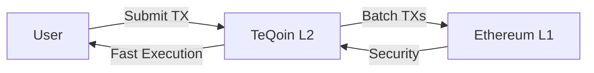

  <h1 className="text-4xl font-bold m-0">Welcome to TeQoin</h1>
  

Welcome to the official TeQoin documentation! TeQoin is an **EVM-compatible Layer-2 scaling solution** built on Ethereum using **Optimistic Rollup technology**.

## What is TeQoin?

TeQoin provides **low-fee, high-speed transactions** while maintaining the security guarantees of Ethereum mainnet. Built for developers, users, and businesses who need scalable blockchain infrastructure without compromising on security.

<CardGroup cols={2}>
  <Card title="low Transaction Fees" icon="coins">
    Enjoy low fee transactions on L2. low fees for users.
  </Card>
  <Card title="5-Second Blocks" icon="clock">
    Lightning-fast transaction finality with 5-second block times.
  </Card>
  <Card title="Full EVM Compatibility" icon="code">
    Deploy existing Ethereum contracts without modifications.
  </Card>
  <Card title="Ethereum Security" icon="shield">
    Inherit Ethereum's security through optimistic rollup technology.
  </Card>
</CardGroup>

## Quick Links

<CardGroup cols={2}>
  <Card title="Quick Start" icon="rocket" href="/quickstart/add-network">
    Get started with TeQoin in 5 minutes
  </Card>
  <Card title="Network Information" icon="network-wired" href="/developers/network-information">
    RPC endpoints, Chain ID, and contract addresses
  </Card>
  <Card title="Bridge Assets" icon="bridge" href="/bridge/deposit-l1-to-l2">
    Move ETH between L1 and L2
  </Card>
  <Card title="Deploy Contracts" icon="file-code" href="/developers/deploy-contract">
    Deploy your first smart contract on TeQoin
  </Card>
</CardGroup>

## Network Information

| Parameter | Value |
|-----------|-------|
| **Network Name** | TeQoin L2 |
| **Chain ID(Testnet)** | 420377 (0x66B69) |
| **Currency Symbol** | ETH |
| **Block Time** | 5 seconds |
| **Finality** | Instant (optimistic) |
| **Challenge Period** | 7 days |

## Key Features

### 🎯 Low-Fee Transactions
Pay **low gas fees** on TeQoin L2. Perfect for microtransactions, gaming, and high-frequency applications.

### ⚡ Lightning Fast
**5-second block times** provide near-instant transaction confirmation. Build responsive dApps with superior UX.

### 🔒 Ethereum Security
TeQoin inherits Ethereum's battle-tested security through optimistic rollup technology and fraud proofs.

### 🛠️ Developer Friendly
Use familiar tools:
- **Solidity** for smart contracts
- **Hardhat/Foundry** for development
- **Web3.js/Ethers.js** for frontend integration
- **MetaMask** for wallet connection

## How It Works

1. **Submit transactions** to TeQoin L2 sequencer
2. **Execute instantly** with 5-second finality
3. **Batch and post** transaction data to Ethereum L1
4. **Inherit security** from Ethereum mainnet

## Get Started

<Steps>
  <Step title="Install Teqoin Wallet in Telegram">
    Configure TeQoin L2 network in your wallet
    
    [Add Network Guide →](/quickstart/add-network)
  </Step>
  
  <Step title="Get Testnet ETH">
    Use our faucet to get test ETH on L2
    
    [Get Testnet ETH →](/quickstart/get-testnet-eth)
  </Step>
  
  <Step title="Make Your First Transaction">
    Send a transaction on TeQoin L2
    
    [First Transaction →](/quickstart/first-transaction)
  </Step>
</Steps>

## Support & Community

Need help? Join our community!

<CardGroup cols={3}>
  <Card title="Telegram" icon="Telegram" href="https://t.me/TeQoin">
    Chat with the community
  </Card>
  <Card title="GitHub" icon="github" href="https://github.com/TeQoin">
    Contribute to the project
  </Card>
  <Card title="Twitter" icon="twitter" href="https://twitter.com/TeQoin">
    Follow for updates
  </Card>
</CardGroup>

---

**Ready to build?** Head to the [Quick Start Guide](/quickstart/add-network) to begin! 🚀
