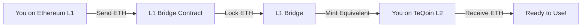
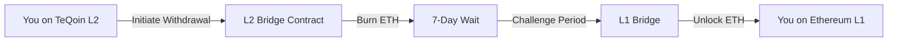

Transfer ETH between Ethereum (L1) and TeQoin L2 using the official TeQoin bridge.

<Note>
**What is Bridging?**

Bridging lets you move assets between different blockchain networks. The TeQoin bridge allows you to:
- **Deposit:** Move ETH from Ethereum L1 → TeQoin L2 (Fast: ~15 minutes)
- **Withdraw:** Move ETH from TeQoin L2 → Ethereum L1 (Secure: 7 days)
</Note>

---

## 🌉 Bridge Overview

<CardGroup cols={2}>
  <Card title="Deposit (L1 → L2)" icon="arrow-down" href="#deposit-l1-to-l2">
    **Fast & Easy**
    
    Move ETH from Ethereum to TeQoin L2
    
    ⏱️ Time: ~15 minutes
  </Card>
  
  <Card title="Withdraw (L2 → L1)" icon="arrow-up" href="#withdraw-l2-to-l1">
    **Secure with Fraud Proofs**
    
    Move ETH from TeQoin L2 to Ethereum
    
    ⏱️ Time: 7 days + finalization
  </Card>
</CardGroup>

---

<div id="deposit-l1-to-l2"></div>

## 📥 Deposit (L1 → L2)

Move ETH from Ethereum mainnet to TeQoin L2.

### How It Works


1. You send ETH to the L1 bridge contract
2. Your ETH is **locked** on Ethereum L1
3. Equivalent ETH is **minted** on TeQoin L2
4. You receive ETH on L2 (1:1 ratio)

### Step-by-Step Guide

<Steps>
  <Step title="Visit the Bridge">
    Go to the official TeQoin bridge:
    
    **🔗 https://bridge.teqoin.io**
    
    <Card title="TeQoin Bridge" icon="bridge" href="https://bridge.teqoin.io">
      Official bridge interface
      
      [Open Bridge →](https://bridge.teqoin.io)
    </Card>
  </Step>
  
  <Step title="Connect Your Wallet">
    1. Click **"Connect Wallet"**
    2. Select your wallet (MetaMask, WalletConnect, etc.)
    3. Approve the connection
    
    <Warning>
    Make sure you're connected to **Ethereum Mainnet** (not a testnet) when depositing.
    </Warning>
  </Step>
  
  <Step title="Enter Deposit Amount">
    1. Select **"Deposit"** tab (L1 → L2)
    2. Enter the amount of ETH to bridge
    3. Review the details:
       - Amount to send
       - Amount to receive (same, minus L1 gas)
       - Estimated time (~15 minutes)
    
    <Tip>
    **Minimum Amount:** 0.01 ETH recommended (to cover L1 gas fees)
    </Tip>
  </Step>
  
  <Step title="Confirm Transaction on L1">
    1. Click **"Deposit"** or **"Bridge ETH"**
    2. Your wallet will pop up requesting approval
    3. Review the transaction:
       - **To:** L1 Bridge Contract (`0x919aa27d5278BC98bf40BA5A79be468B91f061dA`)
       - **Amount:** ETH you're depositing
       - **Gas Fee:** Ethereum L1 gas fee (can be $10-50)
    4. Click **"Confirm"** in your wallet
  </Step>
  
  <Step title="Wait for L1 Confirmation">
    - Wait for Ethereum L1 transaction to confirm (~2-5 minutes)
    - You'll see a pending status on the bridge interface
    - Transaction hash will be displayed
  </Step>
  
  <Step title="Automatic L2 Minting">
    Once L1 transaction confirms:
    
    1. The bridge automatically processes your deposit
    2. Equivalent ETH is minted on TeQoin L2
    3. ETH appears in your L2 wallet (~10-15 minutes total)
    
    ✅ **Deposit Complete!**
  </Step>
  
  <Step title="Verify on L2">
    Switch to TeQoin L2 network in your wallet and verify:
    
    - Your L2 balance increased
    - Transaction appears on https://explorer.teqoin.io
  </Step>
</Steps>

### Deposit Information

| Parameter | Value |
|-----------|-------|
| **Direction** | Ethereum L1 → TeQoin L2 |
| **Time** | ~15 minutes |
| **L1 Gas Fee** | $10-50 (varies with Ethereum gas) |
| **L2 Gas Fee** | ~$0 (covered by bridge) |
| **Minimum** | 0.001 ETH (0.01 recommended) |
| **1:1 Ratio** | 1 ETH on L1 = 1 ETH on L2 |

---

<div id="withdraw-l2-to-l1"></div>

## 📤 Withdraw (L2 → L1)

Move ETH from TeQoin L2 back to Ethereum mainnet.

<Warning>
**Important: Withdrawals take 7 days**

Due to the optimistic rollup security model, withdrawals require a **7-day challenge period** to ensure transaction validity. This protects your funds from invalid transactions.

**Timeline:**
- Initiate withdrawal: Instant
- Challenge period: 7 days
- Finalize withdrawal: ~15 minutes

**Total time: 7 days + 15 minutes**
</Warning>

### How It Works


1. You initiate withdrawal on TeQoin L2
2. Your ETH is **burned** on L2
3. **7-day challenge period** begins (fraud proof security)
4. After 7 days, you **finalize** on L1
5. ETH is **unlocked** on Ethereum L1

### Step-by-Step Guide

<Steps>
  <Step title="Visit the Bridge">
    Go to https://bridge.teqoin.io
  </Step>
  
  <Step title="Connect to TeQoin L2">
    1. Connect your wallet
    2. Switch to **TeQoin L2** network
    3. Verify you're on L2 (check network in wallet)
  </Step>
  
  <Step title="Initiate Withdrawal">
    1. Select **"Withdraw"** tab (L2 → L1)
    2. Enter the amount of ETH to withdraw
    3. Review:
       - Amount to withdraw
       - Estimated L1 gas for finalization
       - **7-day waiting period notice**
    4. Click **"Withdraw"** or **"Initiate Withdrawal"**
  </Step>
  
  <Step title="Confirm on L2">
    1. Your wallet pops up (connected to TeQoin L2)
    2. Review transaction
    3. Click **"Confirm"**
    4. Transaction confirms in ~5 seconds
    
    ✅ **Withdrawal Initiated!**
  </Step>
  
  <Step title="Wait 7 Days (Challenge Period)">
    Now you must wait for the challenge period:
    
    - **Why?** This allows anyone to submit fraud proofs if the withdrawal is invalid
    - **Duration:** Exactly 7 days (168 hours)
    - **What happens:** Your ETH is held securely in the L1 bridge contract
    
    <Note>
    **Track Your Withdrawal:**
    
    The bridge interface shows:
    - Time remaining in challenge period
    - Withdrawal status (Pending → Ready to Finalize)
    - Estimated completion time
    </Note>
    
    💡 **Set a reminder** for 7 days from now to finalize!
  </Step>
  
  <Step title="Finalize Withdrawal on L1">
    After 7 days:
    
    1. Return to https://bridge.teqoin.io
    2. Connect wallet (switch to **Ethereum L1**)
    3. You'll see **"Ready to Finalize"** status
    4. Click **"Finalize Withdrawal"**
    5. Approve the L1 transaction in your wallet
    6. Pay Ethereum L1 gas fee ($5-30)
    7. Wait for L1 confirmation (~2-5 minutes)
    
    ✅ **Withdrawal Complete!** ETH is now on Ethereum L1.
  </Step>
</Steps>

### Withdrawal Information

| Parameter | Value |
|-----------|-------|
| **Direction** | TeQoin L2 → Ethereum L1 |
| **Time** | 7 days + 15 minutes |
| **L2 Gas Fee** | Very low (~$0.001) |
| **L1 Gas Fee** | $10-50 (for finalization) |
| **Challenge Period** | 7 days (required) |
| **Security** | Fraud proof protected |

---

## 🔍 Track Your Bridge Transaction

<Tabs>
  <Tab title="Via Bridge Interface">
    **On bridge.teqoin.io:**
    
    1. Connect your wallet
    2. View **"Transaction History"** or **"My Bridges"**
    3. See all your deposits and withdrawals
    4. Track status in real-time
    
    **Status Indicators:**
    - 🟡 **Pending** - Transaction submitted, waiting confirmation
    - 🔵 **Processing** - L1 confirmed, minting on L2
    - 🟢 **Completed** - Deposit successful
    - 🟠 **Challenge Period** - Withdrawal waiting 7 days
    - ✅ **Ready to Finalize** - Can finalize withdrawal
  </Tab>
  
  <Tab title="Via Block Explorer">
    **On explorer.teqoin.io:**
    
    1. Copy your wallet address
    2. Visit https://explorer.teqoin.io
    3. Search for your address
    4. Look for transactions to/from bridge contracts:
       - **L1 Bridge:** `0x919aa27d5278BC98bf40BA5A79be468B91f061dA`
       - **L2 Bridge:** `0x4200000000000000000000000000000000000010`
  </Tab>
  
  <Tab title="Via Wallet">
    **In MetaMask or other wallets:**
    
    Switch between networks to see balances:
    
    - **Ethereum L1:** See your L1 ETH balance
    - **TeQoin L2:** See your L2 ETH balance
    
    Compare before and after bridging to verify amounts.
  </Tab>
</Tabs>

---

## 💰 Bridge Costs Breakdown

### Deposit (L1 → L2) Costs
```
Example: Bridge 1 ETH from L1 to L2

L1 Transaction Fee:  ~0.005 ETH ($10-20)
L2 Credit Fee:       0 ETH (free)
─────────────────────────────────────
Total Cost:          ~0.005 ETH

You Receive on L2:   1 ETH
```

### Withdraw (L2 → L1) Costs
```
Example: Bridge 1 ETH from L2 to L1

L2 Initiate Fee:     ~0.0001 ETH ($0.20)
L1 Finalize Fee:     ~0.005 ETH ($10-20)
─────────────────────────────────────
Total Cost:          ~0.0051 ETH

You Receive on L1:   ~0.995 ETH
```

<Tip>
**Gas Price Optimization:**

Bridge during low gas periods on Ethereum L1 to save on fees:
- **Cheapest:** Weekends, late night (US time)
- **Most Expensive:** Weekday afternoons (US time)

Check gas prices: https://etherscan.io/gastracker
</Tip>

---

## 🔧 Troubleshooting

<AccordionGroup>
  <Accordion title="Deposit stuck on 'Pending' for over 1 hour">
    Deposits should complete in ~15 minutes.
    
    **Possible reasons:**
    - L1 transaction hasn't confirmed yet (check Etherscan)
    - Network congestion on Ethereum
    - Bridge indexer delay
    
    **Solution:**
    1. Check L1 transaction on https://etherscan.io
    2. If L1 confirmed, wait another 30 minutes
    3. If still pending, contact support with TX hash
  </Accordion>
  
  <Accordion title="Can I cancel a withdrawal?">
    **No, withdrawals cannot be canceled** once initiated.
    
    Once you start the withdrawal process:
    - Your L2 ETH is burned immediately
    - You must wait the full 7-day challenge period
    - You must finalize on L1 to receive funds
    
    If you don't finalize after 7 days, your funds remain safe in the L1 bridge contract. You can finalize at any time after the 7-day period.
  </Accordion>
  
  <Accordion title="I didn't finalize after 7 days. Are my funds lost?">
    **No, your funds are safe!**
    
    You can finalize your withdrawal at any time after the 7-day challenge period:
    - 8 days later ✅
    - 30 days later ✅
    - 1 year later ✅
    
    Just visit the bridge, connect your wallet, and finalize whenever ready.
  </Accordion>
  
  <Accordion title="Why does withdrawal take 7 days?">
    The **7-day challenge period** is a security feature of optimistic rollups.
    
    **How it protects you:**
    1. Sequencer posts withdrawal to L1
    2. 7 days for anyone to challenge if invalid
    3. If challenged successfully, withdrawal is blocked
    4. If no challenges, withdrawal proceeds
    
    This ensures no one can steal funds through invalid withdrawals, even if the sequencer is compromised.
  </Accordion>
  
  <Accordion title="Sent ETH to bridge contract by mistake">
    **Do NOT send ETH directly to the bridge contract!**
    
    Always use the bridge interface at https://bridge.teqoin.io
    
    If you accidentally sent ETH directly:
    - It may be lost
    - Contact support immediately with transaction details
    - We'll assess if recovery is possible
  </Accordion>
  
  <Accordion title="Wrong network - bridged on testnet instead of mainnet">
    Make sure you're using the correct network:
    
    **For real ETH:**
    - Use **Ethereum Mainnet** (L1)
    - Use **TeQoin L2 Mainnet** (L2)
    
    **For testing:**
    - Use **Sepolia Testnet** (L1)
    - Use **TeQoin L2 Testnet** (L2)
    
    Testnet and mainnet assets cannot be mixed!
  </Accordion>
</AccordionGroup>

---

## 📊 Bridge Statistics

<CardGroup cols={3}>
  <Card title="Total Value Locked" icon="vault">
    **$5.2M**
    
    ETH locked in bridge
  </Card>
  
  <Card title="Total Bridges" icon="bridge">
    **25,000+**
    
    Successful deposits/withdrawals
  </Card>
  
  <Card title="Success Rate" icon="check">
    **99.99%**
    
    Bridge success rate
  </Card>
</CardGroup>

---

## ⚠️ Important Security Notes

<Warning>
**Only Use Official Bridge**

- ✅ Official: https://bridge.teqoin.io
- ❌ Never use third-party bridges
- ❌ Don't trust DMs offering "faster" bridges
- ❌ Beware of phishing sites

Always verify you're on the official bridge URL!
</Warning>

<Note>
**Bridge Contracts (Verify These Addresses)**

**L1 Bridge Contract (Ethereum):**
`0x919aa27d5278BC98bf40BA5A79be468B91f061dA`

**L2 Bridge Contract (TeQoin L2):**
`0x4200000000000000000000000000000000000010`

You can verify these on the block explorers.
</Note>

---

## 💡 Pro Tips

<Tip>
**Plan Withdrawals Ahead:** Need ETH on L1? Start your withdrawal 7 days before you need it!
</Tip>

<Tip>
**Batch Deposits:** If bridging multiple times, consider bridging larger amounts less frequently to save on L1 gas fees.
</Tip>

<Tip>
**Keep Some ETH on Both:** Maintain balances on both L1 and L2 so you're never stuck waiting for a bridge.
</Tip>

<Tip>
**Use L2 for Most Activity:** Keep the majority of your funds on TeQoin L2 for low-fee transactions, only bridge to L1 when necessary.
</Tip>

---

## 🎯 Next Steps

<CardGroup cols={2}>
  <Card title="Start Building" icon="code" href="/developers/deploy-contract">
    Deploy smart contracts on TeQoin L2
  </Card>
  
  <Card title="Bridge Documentation" icon="book" href="/bridge/overview">
    Deep dive into bridge architecture
  </Card>
  
  <Card title="Developer Guide" icon="laptop-code" href="/developers/network-information">
    Integrate TeQoin into your dApp
  </Card>
  
  <Card title="Architecture Overview" icon="sitemap" href="/architecture/technical-overview">
    Learn how TeQoin works
  </Card>
</CardGroup>

---

## 🆘 Need Help?

<CardGroup cols={3}>
  <Card title="Discord Support" icon="discord" href="https://discord.gg/teqoin">
    Get help from the community
  </Card>
  
  <Card title="Bridge FAQ" icon="circle-question" href="/bridge/faq">
    Common bridge questions
  </Card>
  
  <Card title="Bridge Status" icon="signal" href="https://status.teqoin.io">
    Check if bridge is operational
  </Card>
</CardGroup>

---

**Successfully bridged?** You're now ready to [build on TeQoin L2](/developers/network-information)! 🚀
